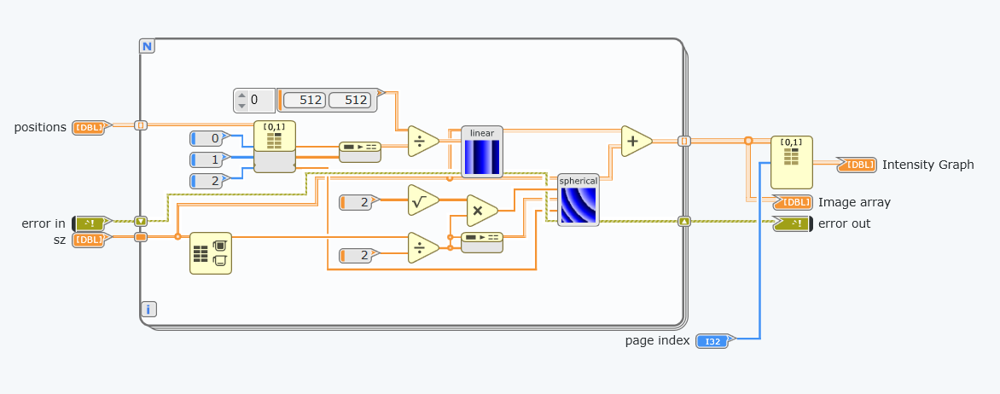

.. _accessing-otslm-from-labview:

############################
Accessing OTSLM from LabVIEW
############################

It is possible to use functionality from OTSLM in LabVIEW. This can be
useful for implementing user interfaces which can be easily customised
or for integrating OTSLM with existing code.

To run MATLAB scripts from LabVIEW, you will need to use
`MathScript <http://www.ni.com/en-au/shop/select/labview-mathscript-module>`__
or `Interface for
MATLAB <http://www.ni.com/product-documentation/54843/en/>`__ depending
on the version of LabVIEW you are using. We have provided an example
package using LabVIEW NXG 3.1 (using LabVIEW Interface for MATLAB) in
the ``examples/labview`` folder of the toolbox.

This section provides an overview of the LabVIEW example package and the
PrismsAndLenses example LabVIEW application. The example package only
provides the features needed for the PrismsAndLenese example. We welcome
contributions from LabVIEW users to improve this package to provide
better coverage of the OTSLM functionality.

.. contents:: Contents
   :depth: 3
   :local:
..

Creating an ``otslm.simple`` function interface
===============================================

LabVIEW Interface for MATLAB (LIFM) provides a system for defining
different interfaces to matlab functions. Using LIFM, you can specify
the input parameter names and types in order to create an object that
can be imported into a VI. The current version of LabVIEW Interface for
MATLAB doesn't provide a good method for dealing directly with string
constants or named parameters, instead it is better to create a separate
VI which wraps the LIFM interface.

In this section we take you through defining a interface for the
:func:`+otslm.+simple.lienar` function. This function takes two required
inputs (the size of the pattern and spacing of the grating) and outputs
a 2D array of doubles for the pattern. The complete example can be found
in
``otslm/examples/labview/OtslmMatlabInterface/otslm.gcomp/simple/linear.mli``
and
``otslm/examples/labview/OtslmMatlabInterface/otslm.gcomp/simple/linear.gvi``.

Start by creating a new Interface for Matlab, go to: **File** > **New**
> **Interface for MATLAB**. In the box marked *Select a MATLAB program
file or enter a MATLAB function name* enter ``otslm.simple.linear`` and
click **Add interface node**. Click **Add parameter** five times and
name the parameters ``im``, ``sz``, ``spacing``, ``centre_str`` and
``centre`` as shown in :numref:`example-labview-linear-interface`.

.. _example-labview-linear-interface:

   Setting up the parameters for the Matlab interface
   to :func:`+otslm.+simple.linear`.

To change the data types and the input/output mode for the parameters,
click on the parameter and change the corresponding settings in the Item
panel, as shown in :numref:`example-labview-item-panel`.

.. _example-labview-item-panel:

   Screenshot of the item configuration panel.

In order to use this interface the ``OTSLM`` path must be added to the
Matlab path. You can do this either by adding the OTSLM path in the
``Startup.m`` script, as described on the getting started page, or you
can run a script which adds OTSLM to the Matlab path. In the example
package, we run a script to add OTSLM to the path. The ``initOtslm.m``
script, located in the ``examples/labview`` directory contains the
following code:

.. code:: matlab

    function initOtslm()

      fname = mfilename('fullpath');
      [fpath, ~, ~] = fileparts(fname);
      fparts = split(fpath, filesep);

      % Add current path
      addpath(fpath);

      % Add toolbox path
      toolbox_path = fullfile(fparts{1:end-2});
      addpath(toolbox_path);

    end

The script first finds the path for the mfile, adds the
``examples/labview`` directory to the path and adds the relative path
for the ``otslm`` directory to the path. To call this script, you will
need to create another Matlab interface and specify the file path to
this script. The interface for this script doesn't need any parameters.
This script should be run at the start of each LabVIEW session or at the
start of each LabVIEW application.

The Matlab interface created for :func:`+otslm.+simple.linear` can now be
included in LabVIEW applications or VIs. To use the interface, you must
connect values to each of the input and output parameters and optionally
the input/output error connectors. However, most of the time you will
not need to change all of the parameters, for instance, the
``centre_str`` parameter will always be the string ``'centre'``. To
simplify the interface and allow customisation of the icon we can create
a wrapper VI for the Matlab interface. To create a new VI, click
**File** > **New** > **VI**. Add the Matlab Interface VI you just
created to the centre of the diagram and connect nodes to the terminals
as shown in :numref:`example-labview-linear-gvi`.

.. _example-labview-linear-gvi:

   Wrapper for LabVIEW interface for matlab.

This interface can be further improved, for instance, making the centre
array optional and checking the length of the array is correct. For
example code, see ``linear.gvi``.

Once the diagram has been configured, you can create a front panel to
test the interface and configure the icon.

Calling a function with a cell array
====================================

The :func:`+otslm.+tools.combine` function takes as input a cell array of
patterns to combine and returns a single pattern as the result. LabVIEW
doesn't currently provide a mechanism for calling a function with a cell
array, however we can work around this by writing a wrapper function
which takes a 3D array of images and converts them to a cell array of 2D
images. The ``unpackCombine.m`` function in ``examples/labview`` does
exactly this:

.. code:: matlab

    function varargout = unpackCombine(input3, varargin)

      input = mat2cell(input3, size(input3, 1), size(input3, 2), ...
        ones(1, size(input3, 3)));

      input = squeeze(input);

      [varargout{1:nargout}] = otslm.tools.combine(input, varargin{:});

    end

It is now possible to create an LabVIEW Interface for Matlab using this
function as described in the previous section.

Creating an ``otslm`` class interface
=====================================

In order to use OTSLM classes, such as :class:`+otslm.+utils.ScreenDevice`
we need to construct and instance of the object, call its methods and clean
up the instance once we are done. LabVIEW only supports creating
function and script interfaces for Matlab. In order to work around this,
we can write a dispatch method which creates the class instance and
handles calls to the function methods. The following is an example of a
dispatch method:

.. code:: matlab

    function varargout = callClassMethod(varname, classname, methodname, varargin)

    assert(~isempty(varname), 'varname must be supplied');

    tmpvarname = 'ourargs';

    if isempty(methodname) && ~isempty(classname)

      % Create a new instance of the class
      assignin('base', tmpvarname, varargin);
      evalin('base', [varname, ' = ', classname, '(', tmpvarname, '{:});']);

    elseif isempty(classname) && ~isempty(methodname)

      % Call a class method
      assignin('base', tmpvarname, varargin);
      [varargout{1:nargout}] = evalin('base', [varname, '.', methodname, '(', tmpvarname, '{:});']);

    else
      error('Only classname or methodname must be supplied');

    end

This function places the Matlab class instance in the base workspace, we
keep track of the class instance using a string (``varname``) in
LabVIEW. To use this dispatch method, we need to create a LabVIEW
Interface for MATLAB for the class and add each class method we wish to
use, including the constructor and destructor. For
:class:`~+otslm.+utils.ScreenDevice`, the interface might look
something like the one shown in :numref:`example-labview-screen-device`.

.. _example-labview-screen-device:

   An interface example for a Matlab class using the
   ``callClassMethod`` dispatch function.

We can then implement a wrapper VI for each of these methods as
described in the previous sections. The ``classname`` and ``methodname``
arguments specify the constructor name and the class method name to be
called. For the destructor, use the string ``'delete'`` for the method
name. In order to use this interface, we need to keep track of the class
instance name and make sure we construct and delete the object before
using other methods of the class. For example usage, see
:ref:`example-labview-building-an-application`.

.. _example-labview-building-an-application:

Building an application
=======================

This section describes building a LabVIEW application for generating a
Prisms and Lenses hologram which is drawn using
:class:`~+otslm.+utils.ScreenDevice`.
You can find the finished application in
``examples/labview/OtslmMatlabInterface/PrismsAndLenses.gcomp``. This
example assumes you have followed the above instructions to implement
your own VIs for the ``spherical``, ``linear``, ``combine`` and
``ScreenDevice`` OTSLM functions/classes or you are using the examples
provided in the ``examples/labview/OtslmMatlabInterface/otslm.gcomp``
package. If you use the example application/package, you will need to
modify the path in ``otslm.gcomp/initOtslm.mli`` to find the correct
path for the ``initOtslm.m`` file.

Create a new application in LabVIEW by going to **File** > **New** >
**Application**. Name the application. Add a new VI to the application
for the front panel (where the main user interface will be displayed):
right click on the application icon in the project browser and click:
**New** > **VI**, as shown in :numref:`example-labview-new-vi`.

.. _example-labview-new-vi:

   Adding a new VI to an application.

Create the VI by adding the controls shown in
:numref:`example-labview-front-panel`.

.. _example-labview-front-panel:

   Layout of front panel.

The user interface will allow the user to specify the size and position
of the window on the screen, change the number and location of spots in
the Prisms and Lenses algorithm, and see a preview of what the image
will look like on the screen.

To implement this, we need to initialise OTSLM, construct the screen
device object for displaying the patterns, generate the array of
patterns to pass to ``otslm.tools.combine`` for each spot the user requests,
and display the result in the previous and on the screen.

To generate the array of patterns for each prisms and lenses spot, we
will create a sub-vi which takes as input the pattern size and spot
locations and generates a 3D array of patterns which we can pass to
combine. Add a new vi to your application and configure it with the
nodes shown in :numref:`example-labview-generate-images`.

.. _example-labview-generate-images:

   Layout of generate images diagram.

To add the **spherical** and **lenses** sub-vis, either click and drag
the VIs from the project file tree or add them from the **Project
Items** menu, as shown in :numref:`example-labview-add-simple-vis`.

.. _example-labview-add-simple-vis:

   Using the project items menu.

Connect the input and output nodes in the icon diagram as shown
in :numref:`example-labview-generate-images-icon`.

.. _example-labview-generate-images-icon:

   Layout of generate images icon.

Next, switch back to the front panel diagram and construct the program
shown in :numref:`example-labview-front-panel-diagram`.

.. _example-labview-front-panel-diagram:
.. figure:: images/examples/labview/frontPanelDiagram.png
   :alt: layout of the front panel diagram

   Layout of the front panel diagram.

In this example we use a loop to continuously update the display when
the user changes inputs to the VI. The ScreenDevice is positioned and
constructed outside the loop, this means that the size of the pattern
and location are fixed throughout the entire run of the program. If the
show display checkbox is not clicked, the ``ScreenDevice`` is asked to
close, otherwise the pattern is displayed to the screen.

