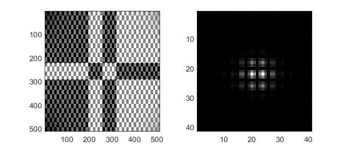
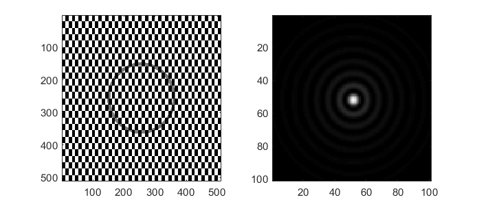
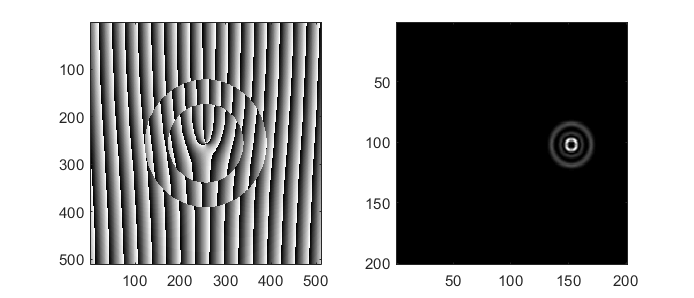
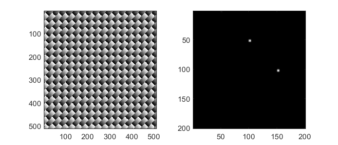
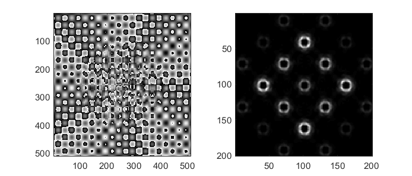
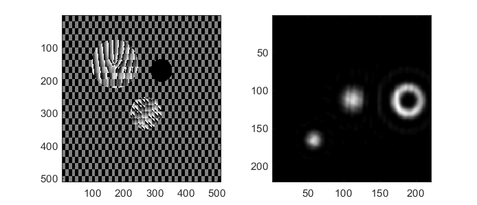
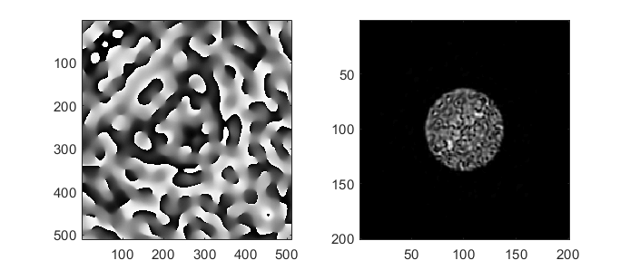
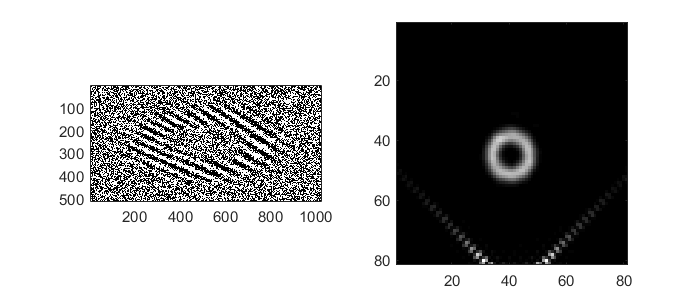

##############
Advanced Beams
##############

This page describes the ``advanced_beams.m`` example. This example
demonstrates some of the more complex hologram generation capabilities
in the toolbox including: combining multiple holograms, shaping the
amplitude with a phase-only device, iterative algorithms, and binary
amplitude patterns.

Note: many of the images in this documentation include checkerboard
patterns. The checkerboard pattern should have a width of 1 pixel to
scatter light to high angles, however the lower resolution images shown
in the documentation appear to have a courser checkerboard pattern as a
result of a Moiré/aliasing effect. To use these patterns, we recommend
generating higher resolution versions using the toolbox.

.. contents:: Contents
   :depth: 3
   :local:
..

Initial setup
=============

The start of the script defines parameters and functions for visualising
the far-field of the SLM. This is mostly the same as the `initial setup
in Simple Beams <Simple-Beams#initial-setup>`__. Some of the advanced
beams include a beam amplitude correction term to compensate for the
non-uniform illumination of the pattern from the incident beam. The beam
correction term is defined as

.. code:: matlab

    beamCorrection = 1.0 - incident + 0.5;
    beamCorrection(beamCorrection > 1.0) = 1.0;

Amplitude control with a phase device
=====================================

In the `LG beam <Simple-Beams#lg-beam>`__ and `HG
beam <Simple-Beams#hg-beam>`__ examples in `Simple
Beams <Simple-Beams>`__ we noted how in order to create pure LG or HG
beams we need to control both the phase and amplitude of the beam. In
the `sinc pattern <Simple-Beams#sinc-pattern>`__ example we used the
``otslm.tools.encode1d`` method to encode a 1-dimensional pattern into a
2-dimensional phase pattern. For encoding two dimensional phase patterns
we need to create a mixture of two patterns: the pattern we want to
generate and a second pattern which scatters light into another
direction. Common choices for the second pattern include: - a uniform
pattern, which would leave light in the centre of the beam - a
checkerboard pattern, which would scatter light into large angles, which
can easily be filtered with a iris - a linear grating to deflect light
to a specific point - another desired part of the far-field intensity
profile

Creating a HG beam
------------------

To create the HG beam, we use the ``otslm.simple.hgmode`` function we
used in the simple beams example, except this time we request both the
phase and amplitude outputs:

.. code:: matlab

    [pattern, amplitude] = otslm.simple.hgmode(sz, 3, 2, 'scale', 50);

To combine the phase, amplitude and beam correction factor, which
accounts for the non-uniform illumination, we can pass the amplitude
terms into ``otslm.tools.finalize``:

.. code:: matlab

    pattern = otslm.tools.finalize(pattern, ...
        'amplitude', beamCorrection.*abs(amplitude));

The finalize method generates a phase mask that is a mixture of the
desired phase pattern and a checkerboard pattern depending on the
amplitude. Internally, the method implements:

.. code:: matlab

    background = otslm.simple.checkerboard(size(pattern), ...
        'value', [-1, 1]);

    % This ratio depends on the background level
    % Amplitude must be between -1 and 1
    mixratio = 2/pi*acos(abs(amplitude));

    % Add the amplitude and mix with the background
    pattern = pattern + angle(amplitude)/(2*pi)+0.5;
    pattern = pattern + mixratio.*angle(background)/(2*pi)+0.5;

The final result is something that looks a lot more like a HG beam than
the simple beams example:

   a better hg beam

Creating a Bessel beam
----------------------

A bessel-like beam can be created in the far-field of the SLM by
creating a annular ring on the device. The phase of the ring can be
constant for Bessel beams without angular momentum, or an azimuthal
phase can be added for Bessel beams with angular momentum. To create the
Bessel beam, we need a ring with a finite power and infinitely small
thickness. This is difficult to achieve, so instead it is better to
create a ring with a finite thickness, for this we can use the
``otslm.simple.aperture`` function to create a ring. We can replace the
regions outside the aperture with a checkerboard pattern to scatter the
light to high angles.

.. code:: matlab

    pattern = otslm.simple.aperture(sz, [ 100, 110 ], 'shape', 'ring');

    % Coorect for amplitude of beam
    pattern = pattern .* beamCorrection;

    % Finalize pattern
    pattern = otslm.tools.finalize(zeros(sz), 'amplitude', pattern);

   a better hg beam

Combining patterns
==================

There are multiple methods for combining beams. The phases can be added
or multiplied or the complex amplitudes can be added or multiplied.

Adding phase patterns
---------------------

Beam phase patterns can be added together at any time. This can be
useful for beam steering, for example, a linear grating or a lens could
be added to another pattern to shift the location in the focal plane. It
is often better to add the phase patterns before calling the finalize
method, since the finalize method applies the modulo to the patterns
which may introduce additional artefacts if patterns are added after
this operation.

.. code:: matlab

    pattern = otslm.simple.lgmode(sz, 3, 2, 'radius', 50);
    pattern = pattern + otslm.simple.linear(sz, 30);
    pattern = otslm.tools.finalize(pattern);

   shifted lg beam

Superposition of beams
----------------------

To create a superposition of different beams we can combine the complex
amplitudes of the individual beams. To do this, we can use the
``otslm.tools.combine`` function which provides a ``super`` method. The
combine function accepts additional arguments for weighted
superpositions and also supports adding random phase offsets using the
``rsuper`` method.

.. code:: matlab

    pattern1 = otslm.simple.linear(sz, 30, 'angle_deg', 90);
    pattern2 = otslm.simple.linear(sz, 30, 'angle_deg', 0);

    pattern = otslm.tools.combine({pattern1, pattern2}, ...
        'method', 'super');

    pattern = otslm.tools.finalize(pattern);

   superposition of beams

Arrays of patterns
------------------

By adding a grating, such as a 2-D sinusoidal grating, to the pattern it
is possible to create arrays of similar spots. This can be a quick
method for creating an array of optical traps or scanning beams for
interacting with many similar samples.

.. code:: matlab

    lgpattern = otslm.simple.lgmode(sz, 5, 0);
    grating = otslm.simple.sinusoid(sz, 50, 'type', '2dcart');

    pattern = lgpattern + grating;
    pattern = otslm.tools.finalize(pattern, 'amplitude', beamCorrection);

   arrays of beams

Selecting regions of interest
-----------------------------

Spatial light modulators can be used for creating beams and sampling
light from specific regions of beams for novel imaging applications. The
toolbox provides a method to help with creating region masks for
sampling different regions of the device. In this example, we show how
``otslm.tools.mask_regions`` can be used to sample three regions of the
device to create three separate beams.

The first stage is to setup three different spots. We specify the
location of each spot, the radius and the pattern. We use
``otslm.tool.finalize`` to apply amplitude corrections and apply the
modulo to the patterns but we request the output remain in the range [0,
1).

.. code:: matlab

    loc1 = [ 170, 150 ];
    radius1 = 75;
    pattern1 = otslm.simple.lgmode(sz, 3, 0, 'centre', loc1);
    pattern1 = pattern1 + otslm.simple.linear(sz, 20);
    pattern1 = otslm.tools.finalize(pattern1, 'amplitude', beamCorrection, ...
        'colormap', 'gray');

    loc2 = [ 320, 170 ];
    radius2 = 35;
    pattern2 = zeros(sz);

    loc3 = [ 270, 300 ];
    radius3 = 50;
    pattern3 = otslm.simple.linear(sz, -20, 'angle_deg', 45);
    pattern3 = otslm.tools.finalize(pattern3, 'amplitude', 0.4, ...
        'colormap', 'gray');

For the background we use a checkerboard pattern.

.. code:: matlab

    background = otslm.simple.checkerboard(sz);

To combine the patterns, we call ``mask_region`` with the background
pattern, the region patterns, their locations, radii and the mask shape
(in this case a circle). We then call ``otslm.tools.finalize`` to
rescale the resulting pattern from the [0, 1) range to the [0, 2pi)
range needed for the visualisation.

.. code:: matlab

    pattern = otslm.tools.mask_regions(background, ...
        {pattern1, pattern2, pattern3}, {loc1, loc2, loc3}, ...
        {radius1, radius2, radius3}, 'shape', 'circle');
      
    pattern = otslm.tools.finalize(pattern);

   three regions of interest

Gerchberg-Saxton
================

The toolbox provides a number of `iterative algorithms <Iter>`__ for
generating patterns. One such algorithm is the Gerchberg-Saxton
algorithm. This method iteratively moving between the near-field and
far-field and replacing the amplitude/phase with the desired
amplitude/phase pattern. The procedure is: 1. Generate initial guess at
the SLM phase pattern: P 2. Calculate output for phase pattern: Proj(P)
**->** O 3. Multiply output phase by target amplitude: ``|T| * O / |O|``
**->** Q 4. Calculate the complex amplitude required to generate Q:
Inv(Q) **->** I 5. Calculate new guess from the phase ofI: Angle(I)
**->** P 6. Goto step 2 until converged

Iterative algorithms are implemented as Matlab classes in OTSLM. To use
the GerchbergSaxton class, we need to generate a target image, specify
the incident illumination and run the method. The GerchbergSaxton class
also implements the adaptive-adaptive algorithm, which we can enable by
setting the ``adaptive`` parameter to a non-unity value.

.. code:: matlab

    im = otslm.simple.aperture(sz, sz(1)/20);
    gs = otslm.iter.GerchbergSaxton(im, 'adaptive', 1.0, ...
        'visdata', {'incident', incident});

To run the algorithm, we simply need to call run with the number of
iterations we would like to run for. The result of the run method is the
pattern. This pattern has a range of 0 to 2pi which does not need to be
passed to ``otslm.tools.finalize`` before visualisation.

.. code:: matlab

    pattern = gs.run(20);

The last guess is also stored in the ``gs`` object. To get the last
guess we can also run ``pattern = gs.guess;``.

   beam created with Gerchberg-Saxton

Creating patterns for the DMD
=============================

A digital micro-mirror device (DMD) is a binary amplitude spatial light
modulator which consists of square pixels arranged in a diagonal
lattice. The arrangement of pixels means that the device has a 1:2
aspect ratio. Although the device can only control the amplitude of
individual pixels, it is still possible to create masks which control
both the phase and amplitude of the resulting beam.

In this example, we create a LG beam using a binary amplitude pattern,
following a similar approach to `Lerner et al., Opt. Lett.37 (23)
4826–4828 (2012) <https://doi.org/10.1364/OL.37.004826>`__. We need to
use a different size and aspect ratio for the DMD, for this example we
will use a device with 512x1024 pixels.

.. code:: matlab

    dmdsz = [512, 1024];
    aspect = 2;

To create the lgmode pattern, we can use the ``otslm.simple.lgmode``
function. This function has an optional argument for the aspect ratio
and returns both the amplitude and phase for the pattern.

.. code:: matlab

    [phase, amplitude] = otslm.simple.lgmode(dmdsz, 3, 0, ...
        'aspect', aspect, 'radius', 100);

The DMD diffraction efficiency when controlling both the phase and
amplitude is fairly low, so we expect there to be a significant amount
of light left in the zero order. We can shift our LG beam away from the
zero order light using a linear diffraction grating. There are also
artifacts from the hard edges of the square (diamond) shaped pixels, to
avoid these artefacts we rotate the linear grating.

.. code:: matlab

    phase = phase + otslm.simple.linear(dmdsz, 40, ...
        'angle_deg', 62, 'aspect', aspect);

For this example we are going to assume uniform illumination. To encode
both the amplitude and phase into the amplitude-only pattern we can use
the finalize function and specify that the device is a dmd and the
colormap is grayscale. By default, the finalize function assumes dmds
should be rotated (packed) differently, however we want to leave our
pattern unchanged for now and explicitly rotate it at a later stage, so
we pass ``none`` as the ``rpack`` option.

.. code:: matlab

    pattern = otslm.tools.finalize(phase, 'amplitude', amplitude, ...
        'device', 'dmd', 'colormap', 'gray', 'rpack', 'none');

At this stage, the pattern is for a continuous amplitude device. To
convert the continuous amplitude to a binary amplitude, we can use
``otslm.tools.dither``. It is possible to do this all in one step using
one call to ``finalize`` but this allows additional control over the
dither.

.. code:: matlab

    pattern = otslm.tools.dither(pattern, 0.5, 'method', 'random');

Up until now, our pattern has been in device pixel coordinates. In order
to visualise what the pattern will look like in the far-field we need to
re-map the device pixel coordinates to the 1:2 aspect ratio found on a
physical device. For this we can use ``finalize`` again, this time with
the ``rpack`` argument set to ``45deg``. We explicityly set no modulo
and a grayscale colourmap again, however our pattern is already binary
so the output will still be zeros and ones.

.. code:: matlab

    patternVis = otslm.tools.finalize(pattern, ...
        'colormap', 'gray', 'rpack', '45deg', 'modulo', 'none');

The final step is to visualise the pattern. For this we create a uniform
incident illumination and we call the ``otslm.tools.visualise`` method
with no phase.

.. code:: matlab

    dmdincident = ones(size(patternVis));

    visOutput = abs(otslm.tools.visualise([], 'amplitude', patternVis, ...
        'method', 'fft', 'padding', padding, 'incident', dmdincident)).^2;

    % Zoom into the resulting pattern
    visOutput = visOutput(ceil(size(visOutput, 1)/2)-50+(-40:40), ...
        ceil(size(visOutput, 2)/2 +(-40:40)));

   dmd pattern
