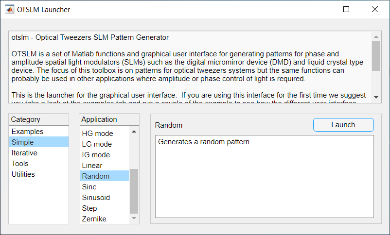
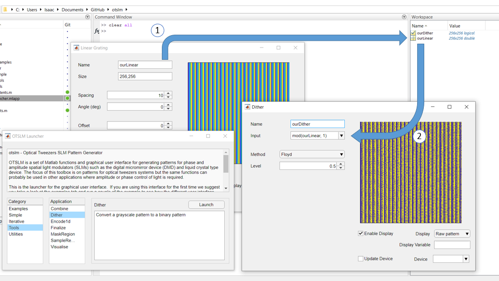

###############
Getting Started
###############

This page will guide you through getting started with OTSLM. This page
is split into three sections: `installation <#installation>`__, `using
the GUIs <#exploring-the-toolbox-with-the-gui>`__, and `writing
functions with the toolbox <#using-the-toolbox-functions>`__.

.. contents::
   :depth: 3
   :local:
..

Installation
============

To install OTSLM, download the latest version of the toolbox to your
computer, if you downloaded a ZIP'ed version of the toolbox, extract the
files. The latest version of OTSLM can be found on the `OTSLM GitHub
page <https://github.com/ilent2/otslm>`__. To run OTSLM, you will need a
recent version of Matlab (we tested OTSLM with Matlab 2018a).

Once downloaded, most of the toolbox functionality is ready to use. To
start exploring the functionality of the toolbox immediately, you can
run the ``examples`` or launch one of the GUIs in the ``+otslm/+ui``
directory. However, for writing your own code, you will probably want to
add the toolbox to the Matlab path. To do this, simply run

.. code:: matlab

    addpath('/path/to/toolbox/otslm');

Replace the path with the path you placed the downloaded toolbox in. The
folder must contain the ``+otslm`` directory and the ``docs`` directory.
If you downloaded the latest toolbox from GitHub, the final part of the
pathname will either be the repository path (if you used ``git clone``)
or something like ``otslm-master`` (if you downloaded a ZIP). The above
line can be added to the start of each of your files or for a more
permanent solution you can add it to the `Matlab startup
script <https://au.mathworks.com/help/matlab/ref/startup.html>`__.

To check that ``otslm`` was found, run the following command and verify
it displays the contents of the ``+otslm/Contents.m`` file

.. code:: matlab

    help otslm

If you have multiple versions of ``otslm`` downloaded, you may want to
check which version is currently being used, use the following command
to check

.. code:: matlab

    what otslm

OTSLM is implemented as a Matlab package, all the core functionality is
contained within the ``+otslm`` directory and can be accessed by adding
the folder containing ``+otslm`` to the path and prefixing the contained
functions with ``otslm.``. For example, to access the linear function in
the ``simple`` sub-package, you would use

.. code:: matlab

    im = otslm.simple.linear([10, 10], 3);

Some functionality requires additional components. You can choose to
install these now or later.

-  `Optical Tweezers Toolbox <https://github.com/ilent2/ott>`__ (1.5.1
   or newer)
-  Python (2.7 or newer)

   -  numpy (tested on 1.13.3)
   -  theano (tested on 0.9)
   -  scipy (tested on 1.0)
   -  pyfftw (optional, for fourier transform)

-  `Red Tweezers <https://doi.org/10.1016/j.cpc.2013.08.008>`__
-  Specific Matlab toolboxes:

   -  Optimization Toolbox
   -  Signal Processing Toolbox
   -  Neural Network Toolbox
   -  Symbolic Math Toolbox
   -  Image Processing Toolbox
   -  Instrument Control Toolbox
   -  Parallel Computing Toolbox
   -  Image Acquisition Toolbox

-  Matlab MEX compatible C++ compiler

In some cases it is possible to re-write functions to avoid using
specific Matlab toolboxes. If you encounter difficultly using a function
because of a missing Matlab toolbox, let us know and we may be able to
help.

Exploring the toolbox with the GUI
==================================

The toolbox includes a graphical user interface (GUI) for many of the
core functions. The user interface allows you to explore the
functionality of the toolbox without writing a single line of code. To
launch the provided GUIs, navigate to the ``+otslm/+ui`` directory and
launch the ``Launcher.mlapp`` program, or alternatively run

.. code:: matlab

    otslm.ui.Launcher

from the Matlab command line. The following window will be displayed

   Launcher

The window is split into 4 sections: a description of the toolbox, a
list of GUI categories, a list of applications, and a description about
the selected application. Once you select an application, click Launch.

Applications which generate a pattern have an option to enter a MATLAB
variable name. When the pattern is generated, the image is saved to the
MATLAB workspace. Applications which take patterns as inputs (for
example, combine and finalize) can use the patterns produced by another
window by simply specifying the same variable name.

   Dataflow in GUI

If an app produces an error or warning, these will be displayed in the
Matlab console.

The example applications show how the user interfaces can be combined to
achieve a particular goal. To get started using the GUI, work through
these examples. For additional information, see the `ui package
documentation <Ui>`__.

It is possible to customize these interfaces, however creating custom
user interfaces in Matlab is rather time consuming and involves a lot of
code duplication. Instead, we recommend using live scripts, see the
`live script example <Grating-And-Lens-LiveScript>`__. It is also
possible to develop user interfaces in LabVIEW, for details see the
`accessing otslm from LabVIEW example <Accessing-otslm-from-labview>`__.

Using the toolbox functions
===========================

The toolbox functions are organised into 4 main packages:
`simple <Simple>`__, `iter <Iter>`__, `tools <Tools>`__ and
`utils <Utils>`__. To use these functions, either prefix the function
with ``otslm`` and the package name

.. code:: matlab

    im = otslm.simple.linear([10, 10], 3);

import a specific function

.. code:: matlab

    import otslm.simple.linear;
    im = linear([10, 10], 3);

or import the entire package

.. code:: matlab

    import otslm.simple.*;
    im1 = linear([10, 10], 3);
    im2 = spherical([10, 10], 3);

Most of the toolbox functions produce/operate on 2-D matrices. The type
of values in these matrices depends on the method, but values will
typically be logical, double or complex. Complex matrices are typically
used when the complex amplitude of the light field needs to be
represented. Double matrices are used for both amplitude and phase
patterns. Logicals are returned when the function could be used as a
mask, for instance, ``otslm.simple.aperture`` returns a logical array by
default.

For phase patterns, there are three type of value ranges: ``[0, 1)``,
``[0, 2*pi)`` and device specific colour range (after applying a lookup
table to the pattern). Most of the ``otslm.simple`` functions return
phase patterns between 0 and 1 or patterns which can be converted to
this range using ``mod(pattern, 1)``. To convert these patterns to the
``[0, 2*pi)`` range or apply a specific colour-map, you can use the
``otslm.tools.finalize`` function.

To get started using the toolbox functions for beam shaping, take a look
at the `Simple <Simple-Beams>`__ and `Advanced <Advanced-Beams>`__
examples. The ``examples`` directory provides examples of other toolbox
functions and how they can be used.

To get help on toolbox functions or classes, type ``help`` followed by
the OTSLM package/function/class/method name. For example, to get help
on the ``simple`` package, type:

.. code:: matlab

    help otslm.simple

or to get help on the ``run`` method in the ``otslm.iter.DirectSearch``
class use

.. code:: matlab

    help otslm.iter.DirectSearch/run

For more extensive help, refer to this documentation.
