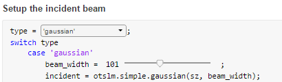

.. _grating-and-lenses-livescript:

############################
Gratings and Lens LiveScript
############################

There are a number of ways to use OTSLM including traditional
Matlab scripts, graphical user interfaces (``.mlapp`` files) and
`live scripts <https://au.mathworks.com/help/matlab/matlab_prog/what-is-a-live-script-or-function.html>`__.
Live scripts offer a method of adding graphical user interface
components (widgets) to your script to allow users to easily change
script parameters, see for example :numref:`example-livescript-slider`.
They are a far simpler method for providing a graphical user interface
experience compared to developing a Matlab application.
Additionally, they can be used to generate formatted output.

.. _example-livescript-slider:

   Screenshot showing two different types of widgets that can be
   created in a live script.

.. only:: html

   The live script can be used to generate PDF and HTML output
   files, `see here for an example <_static/GratingAndLens.html>`__.

.. only:: latex or matlabdoc

   The live script can be used to generate PDF and HTML output
   files, for an example, view the online documentation or
   ``docs/_static/GratingAndLens.html`` downloaded with OTSLM.

At this stage we have provided a single example of using a live script
to control OTSLM: :scpt:`examples.liveScripts.GratingAndLens`.
This live script demonstrates the basics of using OTSLM to generate
a pattern, simulate the far-field and display the image using a screen
device.
The pattern generation and simulation functionality is normal Matlab
code except for the addition of various widgets for controlling/setting
different options.
The major difference between live scripts and traditional scripts is
how they interact with :class:`+otslm.+utils.ScreenDevice`.

Setting up a :class:`~+otslm.+utils.ScreenDevice` in a live script
takes a bit more work
than usual.  Live scripts have their own non-visible figure object
for plotting.  When we show the :class:`~+otslm.+utils.ScreenDevice`
window, a new visible
figure object is created.
After we show the :class:`~+otslm.+utils.ScreenDevice` window for
the first time we need to tell the live script to use the old figure
for internal plots, otherwise it will replace the
:class:`~+otslm.+utils.ScreenDevice` output every time we change a
slider value.
To achieve this, we use the following section of code

.. code:: matlab

   if 0 == exist('sd', 'var') || ~ishandle(sd.figure_handle)
       sd = otslm.utils.ScreenDevice(1, 'target_size', sz,...
           'pattern_type', 'phase', 'prescaledPatterns', true);

       % Get the figure handle for the livescript
       % We need to do this to make ScreenDevice run correctly
       figureHandle = gcf();

       % Show the ScreenDevice figure
       sd.show();

       % Change back to the liveScript figure handle
       % This also needs to be done if we click on another figure
       set(0, 'CurrentFigure', figureHandle);
   end

