.. _simple-beams:

############
Simple Beams
############

This page describes the :scpt:`examples.simple_beams` example. This example
demonstrates some of the simpler hologram generation functions in the
toolbox.

.. contents:: Contents
   :depth: 3
   :local:
..

Initial setup
=============

The example starts by adding the OTSLM toolbox to the path. The
example script is in the ``otslm-directory/examples/`` directory,
allowing us to specify the ``otslm-directory`` relative to the current
directory with ``../``

.. code:: matlab

    addpath('../');

We define a couple of properties for the patterns, starting with the
size of the patterns ``[512, 512]`` and the incident illumination we
will use for the simulation.

.. code:: matlab

    sz = [512, 512];

    % incident = [];        % Incident beam (use default in visualize)
    incident = otslm.simple.gaussian(sz, 150);  % Incident beam (gaussian)
    % incident = ones(sz);  % Incident beam (use uniform illumination)

We use :func:`+otslm.+simple.gaussian` to create a Gaussian profile
for the incident illumination.
Alternatively we could just us the Matlab :func:`ones` function to
create a uniform incident illumination or load a gray-scale image from
a file.

The last part of the setup section defines a couple of functions for
visualising the SLM patterns in the far-field.

.. code:: matlab

    o = 50;              % Region of interest size in output
    padding = 500;        % Padding for FFT
    zoom = @(im) im(round(size(im, 1)/2)+(-o:o), round(size(im, 2)/2)+(-o:o));
    visualize = @(pattern) zoom(abs(otslm.tools.visualise(pattern, ...
        'method', 'fft', 'padding', padding, 'incident', incident)).^2);

This defines a function ``visualize`` which takes a pattern as input,
uses the :func:`+otslm.+tools.visualise` method to simulate what the
far-field looks like using the fast Fourier transform method, calculates the
absolute value squared (converts from the complex output of
:func:`+otslm.+tools.visualise` to an intensity image which we can plot with
:func:`imagesc`) and zooms into a region of interest in the far-field image.
This piece of code isn't really part of the example, it is only included
to make the following sections more succinct. You could replace the use
of the ``visualize`` function in the sections bellow with a single call
the :func:`+otslm.+tools.visualise` and manually zoom into the resulting
image.

Exploring different simple beams
================================

The remainder of the example explores different beams. This section
describes each beam phase pattern and shows the expected output.

Zero phase pattern
------------------

When a constant (or zero) phase pattern is placed on the SLM, the resulting
beam is unmodified (except for a constant phase factor which doesn't
affect the resulting intensity).
When we visualise this beam, we should
see the Fourier transform of the incident beam. If our incident beam is
a Gaussian, we should see a Gaussian-like spot in the far-field, as
shown in :numref:`simple-example-zero-phase`.

.. code:: matlab

    pattern = zeros(sz);
    pattern = otslm.tools.finalize(pattern);
    subplot(1, 2, 1), imagesc(pattern);
    subplot(1, 2, 2), imagesc(visualize(pattern));

.. _simple-example-zero-phase:
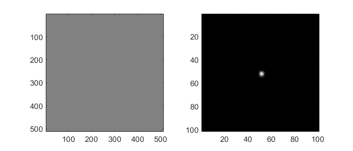

   A phase pattern with zero phase shift (left) and the resulting
   unchanged far-field intensity (right).

This example includes a call to :func:`+otslm.+tools.finalize`, for the zero
phase pattern this call is redundant. If you changed the pattern to a
constant uniform phase shift, for example ``10.5*ones(sz)``,
:func:`+otslm.+tools.finalize` would apply ``mod(pattern, 1)*2*pi`` to the
pattern to ensure the pattern is between 0 and 2pi.

Linear grating
--------------

The linear grating can be used for shifting the focus of a beam in the
far-field. The linear grating acts like a tilted mirror, on the side of
the mirror where the path length is reduced the relative phase is less
than zero, on the side of the mirror where the path length is increased
the phase difference is larger. To create a linear grating you can use
the :func:`+otslm.+simple.linear` function. This function has two required
arguments, the pattern size and the grating spacing. The grating spacing
is proportional to the distance the beam is displaced in the far-field
and inversely proportional to the gradient of the pattern.
:numref:`simple-example-linear` shows a typical output.

.. code:: matlab

    pattern = otslm.simple.linear(sz, 40, 'angle_deg', 45);
    pattern = otslm.tools.finalize(pattern);
    subplot(1, 2, 1), imagesc(pattern);
    subplot(1, 2, 2), imagesc(visualize(pattern));

.. _simple-example-linear:
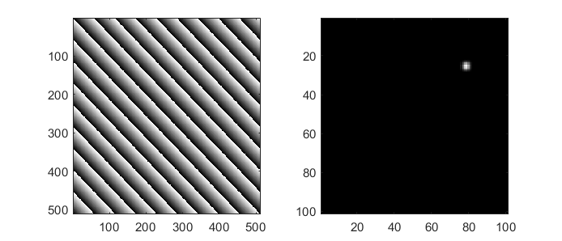

   A blazed grating generated using :func:`+otslm.+simple.linear`
   and and the resulting far-field intensity pattern.

The :func:`+otslm.+simple.linear` function outputs a non-modulated pattern,
as shown in :numref:`simple-example-linear-raw`.
This makes it easier to combine the pattern with other
patterns without introducing artefacts from applying
``mod(pattern, 1)``. Passing the pattern to :func:`+otslm.+tools.finalize`
applies the modulo to the pattern producing the recognisable blazed
grating pattern.

.. _simple-example-linear-raw:
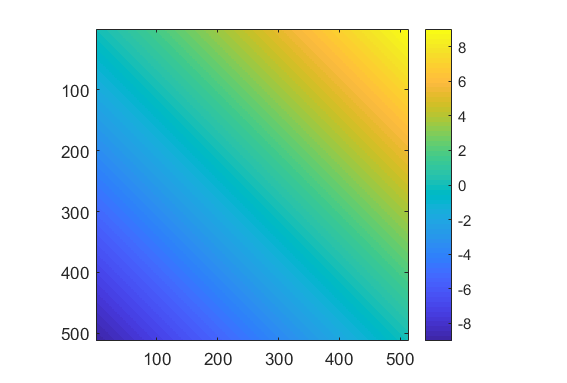

   Un-modulated output from :func:`+otslm.+simple.linear`.

Spherical grating
-----------------

To shift the beam focus along the axial direction we can use a lens
function. The toolbox includes a couple of simple
:ref:`simple-lens-functions`, here we use
:func:`+otslm.+simple.spherical`. This function takes two required arguments:
the pattern size and lens radius. Values outside the lens radius are
invalid, we can choose how these values are represented using the
``background`` optional argument, in this case we choose to replace
these values with a ``checkerboard`` pattern. The checkerboard pattern
diffracts light to high angles (outside the range of the cropping in the
``visualize`` method).

By default, the spherical lens has a height of 1.
We can scale the height by multiplying the output by the desired scale,
this will scale the lens and the background pattern.
To avoid applying the scaling to the background pattern we can
use the ``scale`` optional argument.
Typical output is shown in :numref:`simple-example-spherical`.

.. code:: matlab

    pattern = otslm.simple.spherical(sz, 200, 'scale', 5, ...
        'background', 'checkerboard');
    pattern = otslm.tools.finalize(pattern);
    subplot(1, 2, 1), imagesc(pattern);
    subplot(1, 2, 2), imagesc(visualize(pattern));

.. _simple-example-spherical:
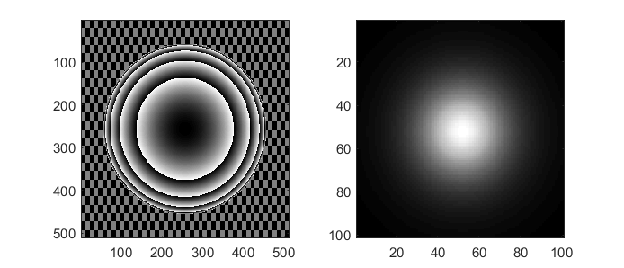

   Typical output and far-field intensity from the
   :func:`+otslm.+simple.spherical` function.
   The output has been modulated to produce the recognisable
   Fresnel-style lens pattern.

The output of :func:`+otslm.+simple.spherical` is non-modulated, similar to
:func:`+otslm.+simple.linear` described above. Only when
:func:`+otslm.+tools.finalize`` is applied does the pattern look like a
Fresnel lens pattern.

.. _simple-beams-lgbeam-example:

LG Beam
-------

The toolbox provides methods for generating the amplitude and phase
patterns for LG beams. To calculate the phase profile for an LG beam, we
can use :func:`+otslm.+simple.lgmode`. This function takes as inputs the
pattern size, azimuthal and radial modes and an optional scaling factor
for the radius of the pattern.
Typical output is shown in :numref:`simple-example-lgbeam`.

.. code:: matlab

    amode = 3;  % Azimuthal mode
    rmode = 2;  % Radial mode
    pattern = otslm.simple.lgmode(sz, amode, rmode, 'radius', 50);
    pattern = otslm.tools.finalize(pattern);
    subplot(1, 2, 1), imagesc(pattern);
    subplot(1, 2, 2), imagesc(visualize(pattern));

.. _simple-example-lgbeam:
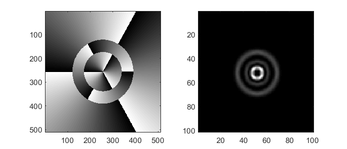

   Example output from :func:`+otslm.+simple.lgmode`.

In order to generate a pure LG beam we need to be able to control both
the amplitude and phase of the light. This can be achieved using
separate devices for the amplitude and phase modulator or by mixing the
amplitude pattern into the phase, as is described in the
:ref:`advanced-beams` example.

.. _simple-beams-hgbeam-example:

HG Beam
-------

Amplitude and phase patterns can be calculated using the
:func:`+otslm.+simple.hgmode` function.
The output from this function is shown in :numref:`simple-example-hgbeam`.
This function takes as input the
pattern size and the two mode indices. There is also an optional
``scale`` parameter for scaling the pattern. As with LG beams,
generation of pure HG beams requires control of both the phase and
amplitude of the light, see the :ref:`advanced-beams` example for
more details.

.. code:: matlab

    pattern = otslm.simple.hgmode(sz, 3, 2, 'scale', 70);
    pattern = otslm.tools.finalize(pattern);
    subplot(1, 2, 1), imagesc(pattern);
    subplot(1, 2, 2), imagesc(visualize(pattern));

.. _simple-example-hgbeam:
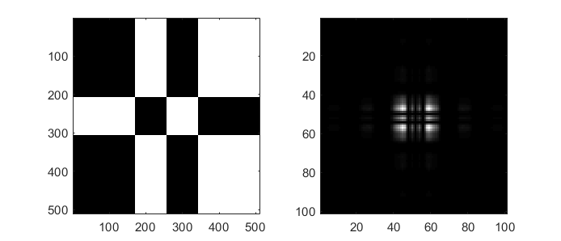

   Phase pattern (left) generated using the :func:`+otslm.+simple.hgmode`
   method and the corresponding simulated far-field (right).
   The simulated far-field doesn't have any amplitude correction,
   leading to a non-pure HG beam output.

.. _simple-beams-sinc-example:

Sinc pattern
------------

A sinc amplitude pattern can be used to generate a line-shaped focal
spot in the far-field. For phase-only SLMs, we need to *encode* the
amplitude in the phase pattern, this can be achieved by mixing the
pattern with a second phase pattern (as described in :ref:`advanced-beams`),
or for 1-D patterns we can encode the
amplitude into the second dimension of the SLM (similar to `Roichman and
Grier, Opt. Lett. 31, 1675-1677
(2006) <https://doi.org/10.1364/OL.31.001675>`__). In this example, we
show the latter.

First we create the ``sinc`` profile using the :func:`+otslm.+simple.sinc`
function. This function takes two required arguments, pattern size and
the sinc radius. The function can generate both 1-dimensional and
2-dimensional sinc patterns, but for the 1-D encoding method we need a
1-dimensional pattern, as shown in :numref:`simple-example-sincraw`.

.. code:: matlab

    radius = 50;
    sinc = otslm.simple.sinc(sz, 50, 'type', '1d');

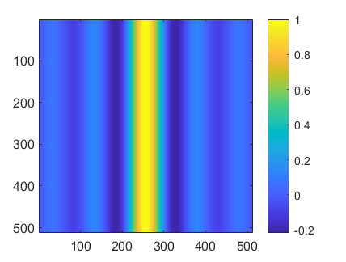

   1-dimensional sinc pattern output from :func:`+otslm.+simple.sinc`.

To encode the 1-dimensional pattern into the second dimension of the SLM
we can use :func:`+otslm.+tools.encode1d`. This method takes a 2-D
amplitude image, the amplitude should be constant in one direction and
variable in the other direction. For the above image, the amplitude is
constant in the vertical direction and variable in the horizontal
direction. The method determines which pixels have a value greater than
the location of the pixel in the vertical direction. Pixels within this
range are assigned the phase of the pattern (0 for positive amplitude,
0.5 for negative amplitudes). Pixels outside this region should be
assigned another value, such as a checkerboard pattern. The encode
method also takes an optional argument to scale the pattern by, this can
be though of as the ratio of pattern amplitude and device height.

.. code:: matlab

    [pattern, assigned] = otslm.tools.encode1d(sinc, 'scale', 200);

    % Apply a checkerboard to unassigned regions
    checker = otslm.simple.checkerboard(sz);
    pattern(~assigned) = checker(~assigned);

We can then finalize and visualise our pattern to produce
:numref:`simple-example-sinc`.

.. code:: matlab

    pattern = otslm.tools.finalize(pattern);
    subplot(1, 2, 1), imagesc(pattern);
    subplot(1, 2, 2), imagesc(visualize(pattern));

.. _simple-example-sinc:
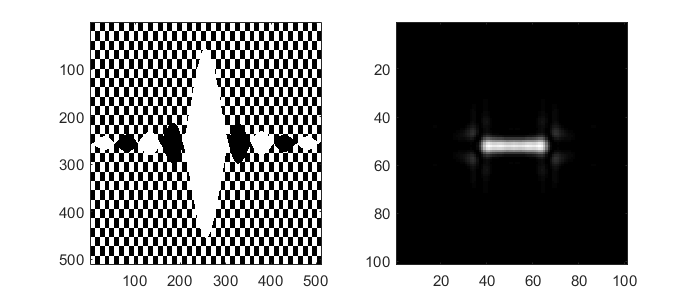

   Sinc pattern encoded with :func:`+otslm.+tools.encode1d`.

Axicon lens
-----------

An axicon (cone shaped) lens can be useful for creating
`Bessel <https://en.wikipedia.org/wiki/Bessel_beam>`__-like beams in the
near-field. In the far-field, the light will have a ring-shaped profile,
while in the near-field the light should have a Bessel-like profile. It
is also possible to combine the axicon lens with an azimuthal
gradient to generate Bessel-like beams with angular momentum.
Example output is shown in :numref:`simple-example-axicon`.

.. code:: matlab

    radius = 50;
    pattern = otslm.simple.axicon(sz, -1/radius);
    pattern = otslm.tools.finalize(pattern);
    subplot(1, 2, 1), imagesc(pattern);
    subplot(1, 2, 2), imagesc(visualize(pattern));

.. _simple-example-axicon:
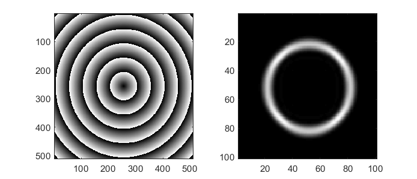

   Axicon pattern (left) and simulated far-field (right).

To see the Bessel-shaped profile, we need to look at the near-field. We
can use the :func:`+otslm.+tools.visualise`
method with a ``z`` offset to view
the near-field of the axicon, as shown in
:numref:`simple-example-axicon-nearfield`.

.. code:: matlab

    im1 = otslm.tools.visualise(pattern, 'method', 'fft', 'trim_padding', true, 'z', 50000);
    im2 = otslm.tools.visualise(pattern, 'method', 'fft', 'trim_padding', true, 'z', 70000);
    im3 = otslm.tools.visualise(pattern, 'method', 'fft', 'trim_padding', true, 'z', 90000);
    figure();
    subplot(1, 3, 1), imagesc(zoom(abs(im1).^2)), axis image;
    subplot(1, 3, 2), imagesc(zoom(abs(im2).^2)), axis image;
    subplot(1, 3, 3), imagesc(zoom(abs(im3).^2)), axis image;

.. _simple-example-axicon-nearfield:
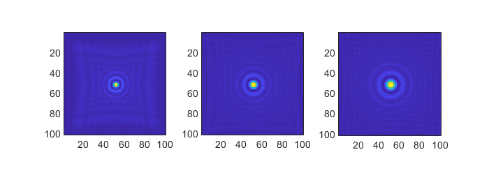

   Visualisation of the near-field of the axicon pattern
   using :func:`+otslm.+tools.visualise` with three different
   axial offsets.

Cubic lens
----------

The cubic lens pattern :func:`+otslm.+simple.cubic`
can be used to create `airy
beams <https://en.wikipedia.org/wiki/Airy_beam>`__.
:numref:`simple-example-airy-beams` shows example output.

.. code:: matlab

    pattern = otslm.simple.cubic(sz);
    pattern = otslm.tools.finalize(pattern);
    subplot(1, 2, 1), imagesc(pattern);
    subplot(1, 2, 2), imagesc(visualize(pattern));

.. _simple-example-airy-beams:
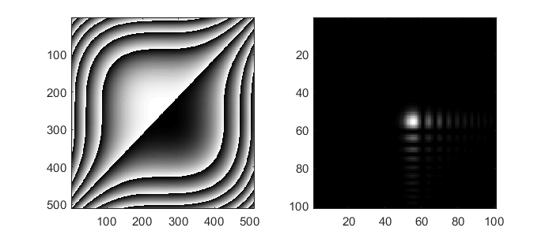

   Example output using :func:`+otslm.+simple.cubic`.

