.. _simple-package:

################
`simple` Package
################

.. automodule:: +otslm.+simple

This page contains a description of the functions contained in the
``otslm.simple`` package. These functions typically have analytic
expressions and the functionality can be implemented in just a few lines
of code. The implementation in the toolbox contains additional inputs to
help with things like centring the patterns or generating the grids.

Most of these functions take as input the size of the image to generate,
a two or three element vector with the width and height of the device;
and parameters specific to the method. They produce one or more matlab
matrices with the specified size. For example, a checkerboard image with
100 rows and 50 columns could be created with:

.. code:: matlab

    rows = 100;
    cols = 50;
    sz = [rows, cols];
    im = otslm.simple.checkerboard(sz);
    imagesc(im);
    disp(size(im));

The functions have been grouped into categories: `lens
functions <#lens-functions>`__, `beams <#beams>`__,
`gratings <#gratings>`__, `3-D functions <#3-d-functions>`__ and
`Miscellaneous <#miscellaneous>`__. This is a very general and
non-unique grouping. The output of many of these functions can be placed
directly on a spatial light modulator as a phase or amplitude masks, or
output of multiple functions can be combined using functions in the
tools package :ref:`tools-package` or matlab operations on arrays
(e.g., array addition or logical indexing).

.. contents:: Contents
   :depth: 1
   :local:
..

.. _simple-lens-functions:

Lens functions
==============

These functions produce a single array. These arrays can be used to
describe the phase functions of different lenses. Most of these
functions support 1-D or 2-D variants, for instance, the spherical
function can be used to create a cylindrical or spherical lens.

.. contents:: Functions
   :depth: 1
   :local:
..

aspheric
--------

.. autofunction:: aspheric

axicon
------

.. autofunction:: axicon

Example:

.. code:: matlab

    sz = [128, 128];
    gradient = 0.1;
    im = otslm.simple.axicon(sz, gradient);

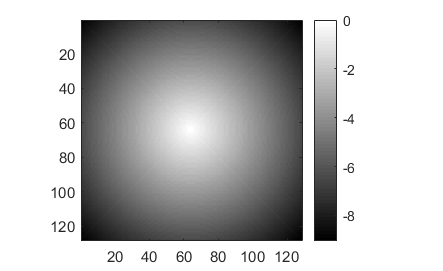

cubic
-----

.. autofunction:: cubic

Example:

.. code:: matlab

    sz = [128, 128];
    im = otslm.simple.cubic(sz);

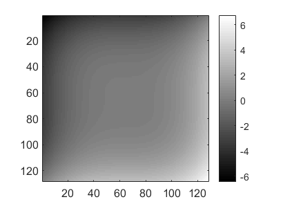

spherical
---------

.. autofunction:: spherical

The following example creates a spherical lens with radius 128 pixels.
The lens is centred in the pattern and a checkerboard pattern is
used for values outside the lens.

.. code:: matlab

    sz = [256, 256];
    radius = 128;
    background = otslm.simple.checkerboard(sz);
    im = otslm.simple.spherical(sz, radius, 'background', background);

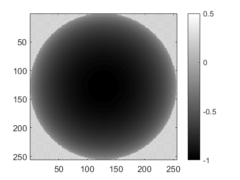

parabolic
---------

.. autofunction:: parabolic

gaussian
--------

.. autofunction:: gaussian

Example usage:

.. code:: matlab

    sz = [128, 128];
    sigma = 64;
    im = otslm.simple.gaussian(sz, sigma, 'scale', 2.0);
    imagesc(im);

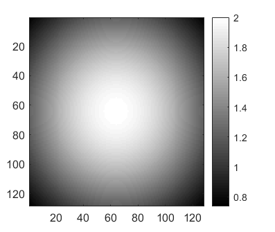

Beams
=====

These functions can be used to calculate the amplitude and phase
patterns for different kinds of beams. To generate these kinds of beams,
and other arbitrary beams, both the amplitude and phase of the beam
needs to be controlled. This can be achieved by generating a phase or
amplitude pattern which combines the phase and amplitude patterns
produced by these functions, for details see
`otslm.tools.finalize <Tools-Package#finalize>`__.

.. contents:: Functions
   :depth: 1
   :local:
..

bessel
------

.. autofunction:: bessel

hgmode
------

`Hermite-Gaussian <https://en.wikipedia.org/wiki/Gaussian_beam#Hermite-Gaussian_modes>`__
(HG) beams are solutions to the paraxial wave equation in
Cartesian coordinates.
Beams are described by two mode indices.

.. autofunction:: hgmode

lgmode
------

`Laguerre-Gaussian <https://en.wikipedia.org/wiki/Gaussian_beam#Laguerre-Gaussian_modes>`__
(LG) beams are solutions to the paraxial wave equation in
cylindrical coordinates.

.. autofunction:: lgmode

igmode
------

`Ince-Gaussian <https://en.wikipedia.org/wiki/Gaussian_beam#Ince-Gaussian_modes>`__
(IG) beams are solutions to the paraxial wave equation in
elliptical coordinates.
The IG modes for a complete basis in elliptic coordinates.
When the ellipticity parameter is infinite, IG beams are equivalent to HG
beams, and when the ellipticity approaches 0, IG beams are equivalent to
LG beams.

.. autofunction:: igmode

Gratings
========

These functions can be used to create periodic patterns which can be
used to create diffraction gratings.

.. contents:: Functions
   :depth: 1
   :local:
..

linear
------

.. autofunction:: linear

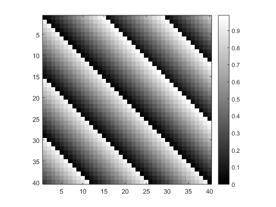

Spacing can be a single number or two numbers for the spacing in the x
and y directions. For an example of how :func:`linear` can be
used to shift the beam focus, see the `grating and lens
example <Lens-Grating>`__.

sinusoid
--------

.. autofunction:: sinusoid

Type of sinusoidal gratings:

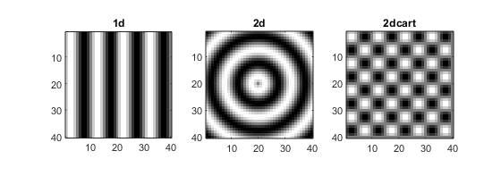

Example usage:

.. code:: matlab

    sz = [40, 40];
    period = 10;
    im = sinusoid(sz, period);

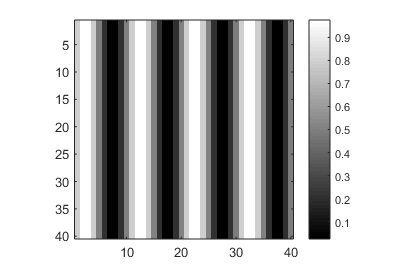

Miscellaneous
=============

Various functions for generating patterns not described in other
sections.
This includes the :func:`grid` and :func:`aperture` functions which
are used to create the grids and masks used by other toolbox functions.

.. contents:: Functions
   :depth: 1
   :local:
..

aperture
--------

.. autofunction:: aperture

The following image shows examples of different apertures.

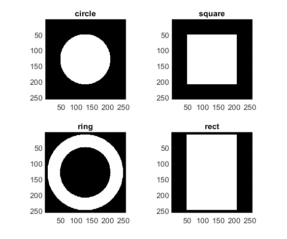

Logical arrays can be used to mask parts of other arrays. This can be
useful for creating composite images, for example:

.. code:: matlab

    sz = [256, 256];
    im = otslm.simple.linear(sz, 256);
    chk = otslm.simple.checkerboard(sz);
    app = otslm.simple.aperture(sz, 80);
    im(app) = chk(app);

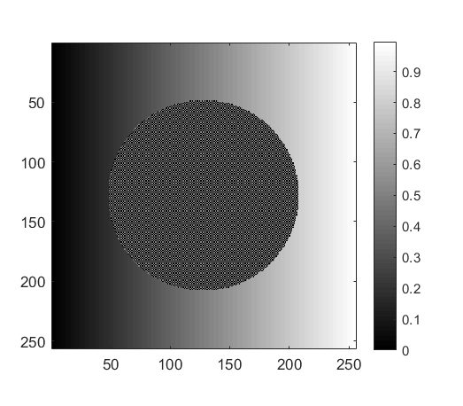

zernike
-------

:func:`zernike` generates a pattern based on the `Zernike
polynomials <https://en.wikipedia.org/wiki/Zernike_polynomials>`__. The
Zernike polynomials are a complete basis of orthogonal functions across
a circular aperture. This makes them useful for describing beams or
phase corrections to beams at the back-aperture of a microscope
objective.

.. autofunction:: zernike

Example usage:

.. code:: matlab

    n = 4;
    m = 2;
    sz = [512, 512];
    im = otslm.simple.zernike(sz, m, n);

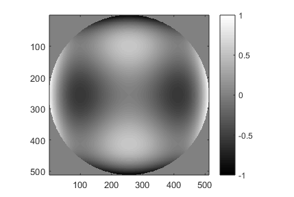

sinc
----

.. autofunction:: sinc

Example usage:

.. code:: matlab

    radius = 10;
    sz = [100, 100];
    im = otslm.simple.sinc(sz, radius);

.. figure:: images/simplePackage/sinc_default.png

checkerboard
------------

.. autofunction:: checkerboard

Example usage:

.. code:: matlab

    sz = [5,5];
    im = otslm.simple.checkerboard(sz);
    imagesc(im);

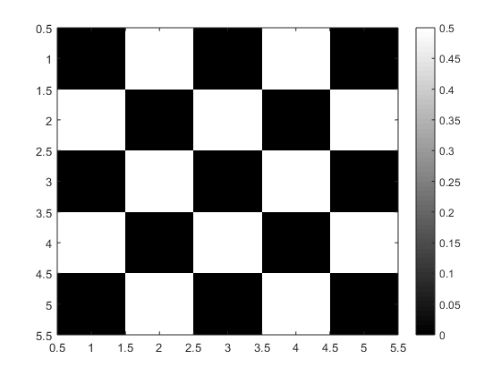

grid
----

.. autofunction:: grid

Example usage:

.. code:: matlab

    sz = [10, 10];
    [xx, yy, rr, phi] = otslm.simple.grid(sz);

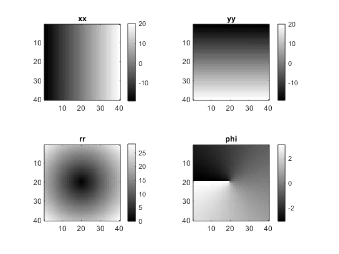

random
------

.. autofunction:: random

Example:

.. code:: matlab

    sz = [20, 20];
    im = otslm.simple.random(sz, 'type', 'binary');

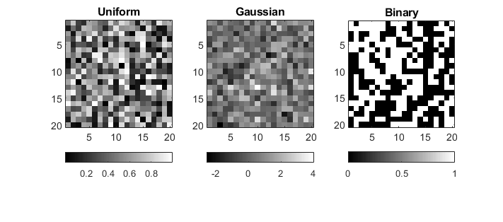

step
----

.. autofunction:: step

Example usage:

.. code:: matlab

    sz = [5, 5];
    im = otslm.simple.step(sz);

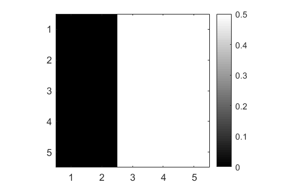

3-D functions
=============

These functions generate a 3-D volume instead of a 2-D image. The size
parameter is a 3 element vector for the ``x, y, z`` dimension sizes.

.. contents:: Functions
   :depth: 1
   :local:
..

aperture3d
----------

.. autofunction:: aperture3d

grid3d
------

.. autofunction:: grid3d

gaussian3d
----------

.. autofunction:: gaussian3d

linear3d
--------

.. autofunction:: linear3d

