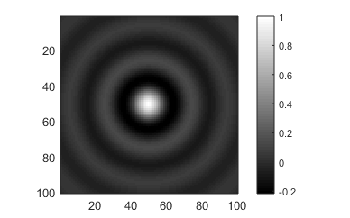

.. _simple-package:

################
`simple` Package
################

.. automodule:: +otslm.+simple

This page contains a description of the functions contained in the
``otslm.simple`` package. These functions typically have analytic
expressions and the functionality can be implemented in just a few lines
of code. The implementation in the toolbox contains additional inputs to
help with things like centring the patterns or generating the grids.

Most of these functions take as input the size of the image to generate,
a two or three element vector with the width and height of the device;
and parameters specific to the method. They produce one or more matlab
matrices with the specified size. For example, a checkerboard image with
100 rows and 50 columns could be created with:

.. code:: matlab

    rows = 100;
    cols = 50;
    sz = [rows, cols];
    im = otslm.simple.checkerboard(sz);
    imagesc(im);
    disp(size(im));

The functions have been grouped into categories: :ref:`simple-lens-functions`,
:ref:`simple-beams`, :ref:`simple-gratings`, :ref:`simple-3d-functions`
and :ref:`simple-misc`. This is a very general and
non-unique grouping. The output of many of these functions can be placed
directly on a spatial light modulator as a phase or amplitude masks, or
output of multiple functions can be combined using functions in the
:ref:`tools-package` or Matlab operations on arrays
(e.g., array addition or logical indexing).

.. contents:: Contents
   :depth: 1
   :local:
..

.. _simple-lens-functions:

Lens functions
==============

These functions produce a single array. These arrays can be used to
describe the phase functions of different lenses. Most of these
functions support 1-D or 2-D variants, for instance, the spherical
function can be used to create a cylindrical or spherical lens.

.. contents:: Functions
   :depth: 1
   :local:
..

aspheric
--------

.. autofunction:: aspheric

axicon
------

.. autofunction:: axicon

Example (see also :numref:`simple-axicon-example`):

.. code:: matlab

    sz = [128, 128];
    gradient = 0.1;
    im = otslm.simple.axicon(sz, gradient);

.. _simple-axicon-example:

   Example of a axicon lens.

cubic
-----

.. autofunction:: cubic

Example (see also :numref:`simple-cubic-example`):

.. code:: matlab

    sz = [128, 128];
    im = otslm.simple.cubic(sz);

.. _simple-cubic-example:

   Example of a cubic function.

spherical
---------

.. autofunction:: spherical

The following example creates a spherical lens with radius 128 pixels,
as shown in :numref:`simple-spherical-example`.
The lens is centred in the pattern and a checkerboard pattern is
used for values outside the lens.

.. code:: matlab

    sz = [256, 256];
    radius = 128;
    background = otslm.simple.checkerboard(sz);
    im = otslm.simple.spherical(sz, radius, 'background', background);

.. _simple-spherical-example:

   Example of a spherical lens.

parabolic
---------

.. autofunction:: parabolic

gaussian
--------

.. autofunction:: gaussian

Example usage (see also :numref:`simple-gaussian-example`):

.. code:: matlab

    sz = [128, 128];
    sigma = 64;
    im = otslm.simple.gaussian(sz, sigma, 'scale', 2.0);
    imagesc(im);

.. _simple-gaussian-example:

   Example output from :func:`gaussian`.

.. _simple-beams:

Beams
=====

These functions can be used to calculate the amplitude and phase
patterns for different kinds of beams. To generate these kinds of beams,
and other arbitrary beams, both the amplitude and phase of the beam
needs to be controlled. This can be achieved by generating a phase or
amplitude pattern which combines the phase and amplitude patterns
produced by these functions, for details see the
:ref:`advanced-beams` example and :func:`+otslm.+tools.finalize`.

.. contents:: Functions
   :depth: 1
   :local:
..

bessel
------

.. autofunction:: bessel

hgmode
------

`Hermite-Gaussian <https://en.wikipedia.org/wiki/Gaussian_beam#Hermite-Gaussian_modes>`__
(HG) beams are solutions to the paraxial wave equation in
Cartesian coordinates.
Beams are described by two mode indices.

.. autofunction:: hgmode

lgmode
------

`Laguerre-Gaussian <https://en.wikipedia.org/wiki/Gaussian_beam#Laguerre-Gaussian_modes>`__
(LG) beams are solutions to the paraxial wave equation in
cylindrical coordinates.

.. autofunction:: lgmode

igmode
------

`Ince-Gaussian <https://en.wikipedia.org/wiki/Gaussian_beam#Ince-Gaussian_modes>`__
(IG) beams are solutions to the paraxial wave equation in
elliptical coordinates.
The IG modes for a complete basis in elliptic coordinates.
When the ellipticity parameter is infinite, IG beams are equivalent to HG
beams, and when the ellipticity approaches 0, IG beams are equivalent to
LG beams.

.. autofunction:: igmode

.. _simple-gratings:

Gratings
========

These functions can be used to create periodic patterns which can be
used to create diffraction gratings.

.. contents:: Functions
   :depth: 1
   :local:
..

linear
------

.. autofunction:: linear

:numref:`simple-linear-example` shows example output.

.. _simple-linear-example:

   Example output from :func:`linear`.

Spacing can be a single number or two numbers for the spacing in the ``x``
and ``y`` directions. For an example of how :func:`linear` can be
used to shift the beam focus, see
:ref:`grating-and-lenses-livescript`.

sinusoid
--------

.. autofunction:: sinusoid

:numref:`simple-sinusoid-types` shows different types of
sinusoid gratings supported by the function.

.. _simple-sinusoid-types:
.. figure:: images/simplePackage/sinusoid_types.png
   :alt: different sinusoid gratings

   Example of different sinusoid gratings generated using :func:`sinusoid`.

Example usage (see also :numref:`simple-sinusoid-example`):

.. code:: matlab

    sz = [40, 40];
    period = 10;
    im = sinusoid(sz, period);

.. _simple-sinusoid-example:

   Example output from :func:`sinusoid`.

.. _simple-misc:

Miscellaneous
=============

Various functions for generating patterns not described in other
sections.
This includes the :func:`grid` and :func:`aperture` functions which
are used to create the grids and masks used by other toolbox functions.

.. contents:: Functions
   :depth: 1
   :local:
..

aperture
--------

.. autofunction:: aperture

:numref:`simple-aperture-types` shows examples of different apertures.

.. _simple-aperture-types:

   Example of different aperture types generated by :func:`aperture`.

Logical arrays can be used to mask parts of other arrays. This can be
useful for creating composite images, for example (see also
:numref:`simple-aperture-example`):

.. code:: matlab

    sz = [256, 256];
    im = otslm.simple.linear(sz, 256);
    chk = otslm.simple.checkerboard(sz);
    app = otslm.simple.aperture(sz, 80);
    im(app) = chk(app);

.. _simple-aperture-example:
.. figure:: images/simplePackage/aperture_logicals.png
   :alt: Aperture used for logical array indexing

   Example of using :func:`aperture` to generate logical arrays
   for masking two patterns.

aberrationRiMismatch
--------------------

.. autofunction:: aberrationRiMismatch

Example usage (see also :numref:`simple-aberrationRiMismatch-example`):

.. code:: matlab

  sz = [512, 512];
  n1 = 1.5;
  n2 = 1.33;
  NA = 0.4;
  alpha = asin(NA/n1);
  pattern = otslm.simple.aberrationRiMismatch(sz, ...
      n1, n2, alpha, 'depth', 2.0);

.. _simple-aberrationRiMismatch-example:
.. figure:: images/simplePackage/aberrationRiMismatch_example.png
   :alt: example aberrationRiMismatch output

   Example output from :func:`aberrationRiMismatch`.

zernike
-------

:func:`zernike` generates a pattern based on the `Zernike
polynomials <https://en.wikipedia.org/wiki/Zernike_polynomials>`__. The
Zernike polynomials are a complete basis of orthogonal functions across
a circular aperture. This makes them useful for describing beams or
phase corrections to beams at the back-aperture of a microscope
objective.

.. autofunction:: zernike

Example usage (see also :numref:`simple-zernike-example`):

.. code:: matlab

    n = 4;
    m = 2;
    sz = [512, 512];
    im = otslm.simple.zernike(sz, m, n);

.. _simple-zernike-example:

   Example output from :func:`zernike`.

sinc
----

.. autofunction:: sinc

Example usage (see also :numref:`simple-sinc-example`):

.. code:: matlab

    radius = 10;
    sz = [100, 100];
    im = otslm.simple.sinc(sz, radius);

.. _simple-sinc-example:

   Example output from :func:`sinc`.

checkerboard
------------

.. autofunction:: checkerboard

Example usage (see also :numref:`simple-checkerboard-example`):

.. code:: matlab

    sz = [5,5];
    im = otslm.simple.checkerboard(sz);
    imagesc(im);

.. _simple-checkerboard-example:

   Example output from :func:`checkerboard`.

grid
----

.. autofunction:: grid

Example usage (see also :numref:`simple-grid-example`):

.. code:: matlab

    sz = [10, 10];
    [xx, yy, rr, phi] = otslm.simple.grid(sz);

.. _simple-grid-example:

   Example output from :func:`grid`.

random
------

.. autofunction:: random

Example (see also :numref:`simple-random-example`):

.. code:: matlab

    sz = [20, 20];
    im = otslm.simple.random(sz, 'type', 'binary');

.. _simple-random-example:

   Example output from :func:`random`.

step
----

.. autofunction:: step

Example usage (see also :numref:`simple-step-example`):

.. code:: matlab

    sz = [5, 5];
    im = otslm.simple.step(sz);

.. _simple-step-example:

   Example output from :func:`step`.

.. _simple-3d-functions:

3-D functions
=============

These functions generate a 3-D volume instead of a 2-D image. The size
parameter is a 3 element vector for the ``x, y, z`` dimension sizes.

.. contents:: Functions
   :depth: 1
   :local:
..

aperture3d
----------

.. autofunction:: aperture3d

grid3d
------

.. autofunction:: grid3d

gaussian3d
----------

.. autofunction:: gaussian3d

linear3d
--------

.. autofunction:: linear3d

