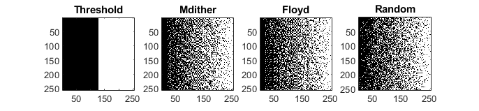
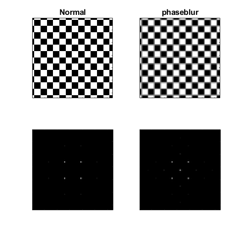
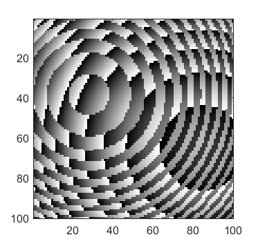

.. _tools-functions:

Functions
=========

.. contents::
   :local:

.. automodule:: +otslm.+tools

combine
-------

.. autofunction:: combine

dither
------

The :func:`dither` function can be used to convert a continuous gray-scale
image into a binary pattern.
This can be useful for converting gray-scale amplitude images into
binary images for display on a digital micro-mirror device.

The function supports a range of different dither methods including
Matlab's builtin dither, raw thresholding, random dithering and
using the Floyd-Steinberg algorithm.
The folowwing code example demonstrates a couple of different
methods, the results are shown in :numref:`tools-package-dither`.

.. code:: matlab

   im = otslm.simple.linear([256, 256], 256);
   d1 = otslm.tools.dither(im, 0.5, 'method', 'threshold');
   d2 = otslm.tools.dither(im, 0.5, 'method', 'mdither');
   d3 = otslm.tools.dither(im, 0.5, 'method', 'floyd');
   d4 = otslm.tools.dither(im, 0.5, 'method', 'random');

.. _tools-package-dither:

   Example output from :func:`dither` using different methods.

.. autofunction:: dither

encode1d
--------

.. autofunction:: encode1d

finalize
--------

.. autofunction:: finalize

hologram2volume
---------------

.. autofunction:: hologram2volume

mask\_regions
-------------

.. autofunction:: mask_regions

sample\_region
--------------

.. autofunction:: sample_region

spatial\_filter
---------------

.. autofunction:: spatial_filter

visualise
---------

.. autofunction:: visualise

bsc2hologram
------------

.. autofunction:: bsc2hologram

colormap
--------

.. autofunction:: colormap

hologram2bsc
------------

.. autofunction:: hologram2bsc

phaseblur
---------

The :func:`phaseblur` function can be used to simulate how a pattern
is affected by cross-talk between the pixels.
For example, the following example shows how the effect of cross-talk
on a checkerboard could be simulated.
Results are shown in :numref:`tools-phaseblur-example`.

.. code:: matlab

   sz = [128, 128];

   % Normal checkerboard
   chk = otslm.simple.checkerboard(sz, 'spacing', 10);
   chk = otslm.tools.finalize(chk);

   % Blurred checkerboard
   blur = otslm.tools.phaseblur(chk);

   % Simulate far-field
   im1 = otslm.tools.visualise(chk, 'trim_padding', true);
   im2 = otslm.tools.visualise(blur, 'trim_padding', true);

.. _tools-phaseblur-example:

   Checkerboard pattern and simulated far-field (left) and the
   same checkerboard pattern after using the :func:`phaseblur`
   function (right).

.. autofunction:: phaseblur

volume2hologram
---------------

.. autofunction:: volume2hologram

castValue
---------

This function is used to convert from logical patterns to another
data type, such as double or integer.
It is mainly used by functions which create binary masks including
:func:`+simple.aperture` and :func:`+simple.step`.
When the resulting pattern is used for indexing another pattern,
the output should be logical.
However, if the resulting pattern corresponds to phase or amplitude
values, this function can be used to perform the cast.

For example, to convert from a logical pattern to a pattern with
two discrete integer levels, we could do

.. code:: matlab

   in = [false(3, 3), true(3, 3)];
   out = otslm.tools.castValue(in, uint8([0, 27]));

   % Check that the output class matches the desired class (uint8)
   disp(class(out));

.. autofunction:: castValue

lensesAndPrisms
---------------

This function implements the lenses and prisms algorithm.
The algorithm can be used to generate multiple spots by adding the
complex amplitude of each pattern together.
The location of each spot is controlled using a lens (for axial position)
or a linear grating (prism, for radial positioning).
The algorithm can be implemented in just a few lines of code using
the toolbox:

.. code:: matlab

   sz = [128, 128];

   lin1 = otslm.simple.linear(sz, [10, 5]);
   len1 = otslm.simple.spherical(sz, sz(1)*2);

   lin2 = otslm.simple.linear(sz, [-5, 15]);
   len2 = otslm.simple.spherical(sz, -sz(1)*2.7);

   pattern = otslm.tools.combine({lin1+len1, lin2+len2}, 'method', 'super');

However, this requires each pattern to be stored in memory until
they can be combined in a single call to :func:`combine`.
This can become a problem when hundreds of patterns need to be
combined or if running on hardware with limited memory such as a GPU.

The :func:`lensesAndPrisms` function is a more memory efficient
implementation of the above.
Firstly, it performs the combination after each pattern has been
created, removing the need to store all the component patterns.
Further, instead of calculating multiple linear gratings and spherical
lenses, the function calculates a single x, y and lens pattern
and scales these patterns to generate a component pattern.
In code, the operation performed is

.. code:: matlab

   % Locations of 2 spots (3x2 matrix)
   xyz = [1, 2, 3; 4, 5, 6].';

   for ii = 1:size(xyz, 2)
      pattern = pattern + exp(1i*2*pi* ...
         (xyz(3, ii)*lens + xyz(1, ii)*xgrad + xyz(2, ii)*ygrad));
   end

To use the function, we simply need to pass in a matrix for the
spot locations.  Additionally, we could pass in weights for the
different components or custom patterns for the lens and gratings.
Example output is shown in :numref:`tools-lp-example`.

.. code:: matlab

   sz = [100, 100];
   xyz = [10, 5, 0.1; -3, -2, -0.2] ./ sz(1);
   pattern = otslm.tools.lensesAndPrisms(sz, xyz.');

.. _tools-lp-example:

   Example output from :func:`lensesAndPrisms`.

.. autofunction:: lensesAndPrisms

make\_beam
----------

This function combines the amplitude and phase image into a single
complex amplitude pattern.
Mathematically, the function does

.. math::

   U = I \times A \times \exp(i\phi)

where :math:`I` is the incident illumination, :math:`\phi` is the
phase and :math:`A` is the amplitude.

The function handles both 2-D patterns and 3-D volumes as well as
a bunch of the size of the patterns and default values for any
empty inputs.

.. autofunction:: make_beam

