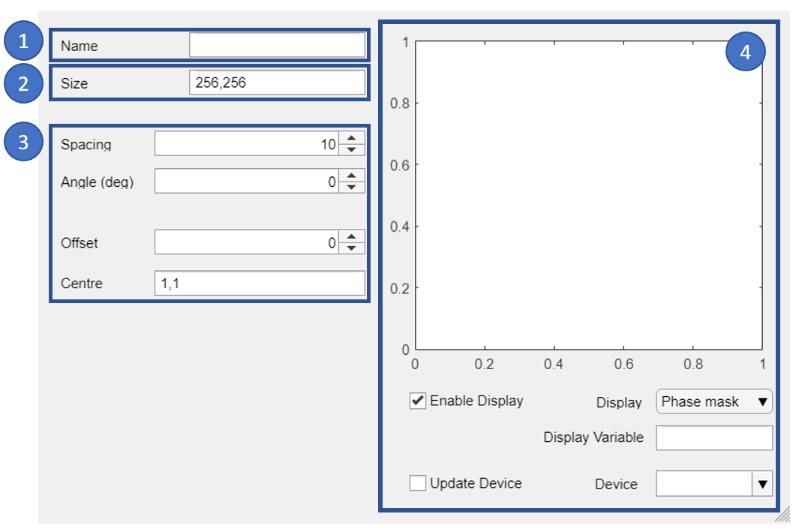

.. _ui-package:

############
`ui` Package
############

The UI sub-package contains graphical user interfaces for exploring the
toolbox functionality. The sub-package contains the :app:`Launcher`
GUI which provides a list of
components and a brief description of their function. The rest of the
sub-package is split between ``simple``, ``utils``, ``tools``, ``iter``,
and ``examples`` sub-packages providing interfaces to the OTSLM core
packages and examples of how the UI can be combined. The UI sub-package
also contains a :mod:`+otslm.+ui.+support` sub-package with
common code used by the GUIs.

This section provides information required to extend the Launcher,
or other GUI windows as well as a
brief :ref:`overview of the other GUI components <ui-simple-gui-overview>`.
For details on the functions the GUIs represent, see the corresponding
package documentation: :ref:`iter-package`, :ref:`tools-package`,
:ref:`simple-package` or :ref:`utils-package`.
For details on how to use the GUIs, see :ref:`getting-started`
and :ref:`examples`.

.. contents:: Contents
   :depth: 1
   :local:
..

Launcher
========

.. autoapplication:: +otslm.+ui.+Launcher

The launcher consists of two layers: the category list and the
application list. The application list is populated when the user
selects a category. Details about the programs are specified in the
``CategoryListBoxValueChanged`` function and ``*Data`` functions.

Specifying application names
----------------------------

Application names are specified in the ``CategoryListBoxValueChanged``
function. To add a new application, extend the ``ItemsData`` and
``Items`` fields of the ``ApplicationListBox`` for the category you wish
to place the app in. The ``ItemsData`` field is used in the ``*Data``
function (see below) to get the application name and description.

Program name, description and launch command
--------------------------------------------

Information about each of the programs is defined in the ``*Data``
functions, one function for each sub-package: ``ExampleData``,
``IterativeData``, ``ToolsData``, ``UtilitiesData`` and ``SimpleData``.

These functions return a struct with the fields ``Name``,
``Description`` and ``AppName`` for the user-readable name, description
and the Matlab application name to launch. The value returned depends on
the current value for the ``ApplicationListBox`` list box. In order to
extend the applications list, simply add a new case to the switch for
the new application and set the corresponding values in the ``data``
struct, for example:

.. code:: matlab

    data.Name = 'Mixing Two Beams';
    data.Description = ['This example shows how to generate a phase only diffraction ' ...
        'grating to split a beam into two independently controllable spots.'];
    data.AppName = 'otslm.ui.examples.MixingTwoBeams';

.. _ui-simple-gui-overview:

Simple GUI overview
===================

Most GUIs are split into 4 main sections, shown in
:numref:`ui-simple-overview-fig`

.. _ui-simple-overview-fig:

   Overview of `ui.simple.linear` graphical user interface.
   The layout consists of:
   (1) Output variable name;
   (2) Size of pattern (mostly used on ``ui.simple.*`` GUIs);
   (3) Controls for the method; and
   (4) Pattern preview window.

When the window launches it will search the base workspace for variables
names and :class:`+otslm.+utils.Showable` devices which can be used for
displaying the pattern (see :func:`+otslm.+ui.+support.populateDeviceList`).

Methods which updated as soon as the user changes a value will have most
of the implementation contained in a callback function. For
:app:`+ui.+simple.linear`, this is done in
:func:`+otslm.+ui.+support.patternValueChanged`.
The content of this function involves first getting the inputs
from the user and converting the strings to variables:

.. code:: matlab

    % Get the UI fileds for generating the pattern
    name = app.NameEditField.Value;
    sz = evalin('base', ['[', app.SizeEditField.Value, ']']);
    spacing = app.SpacingSpinner.Value;
    angle_deg = app.AngledegSpinner.Value;
    offset = app.OffsetSpinner.Value;
    centre = evalin('base', ['[', app.CentreEditField.Value, ']']);

The function then calls the OTSLM method:

.. code:: matlab

    % Generate the pattern
    pattern = otslm.simple.linear(sz, spacing, ...
        'centre', centre, 'angle_deg', angle_deg);
    pattern = pattern + offset;

And finally, calls the
:func:`+otslm.+ui.+support.simplePatternValueChanged` helper
handle updating the preview window, saving the result to
the workspace and updating the device.

.. code:: matlab

    % Offload to the base class (sort of...)
    otslm.ui.support.simplePatternValueChanged(name, pattern, ...
        app.DeviceDropDown.Value, app.UpdateDeviceCheckBox.Value, ...
        app.EnableDisplayCheckBox.Value, app.UIAxes, ...
        app.DisplayDropDown.Value, app.DisplayVariableEditField.Value);

Most functions will have a public ``updateView`` function which can be
used by other GUI windows to force an update to window after values have
changed.

Support sub-package
===================

.. automodule:: +otslm.+ui.+support

The support sub-package contains common code and functions used by the
GUI components. These support functions can be used to design additional
user interfaces using the toolbox. This section briefly describes these
functions and how they are used by the existing GUI components.

.. warning::
   Some of these functions should really be part of a custom GUI component
   layout class. To the best of our knowledge, this is currently not
   supported for Matlab Apps in R2018a. If this changes in a future Matlab
   release, much of this code will likely move/change.

.. contents:: Contents
   :depth: 1
   :local:
..

calculateImageSliceFreq
-----------------------

.. autofunction:: calculateImageSliceFreq

checkImagesChanged
------------------

.. autofunction:: checkImagesChanged

cleanTimer
----------

.. autofunction:: cleanTimer

complexPatternValueChanged
--------------------------

.. autofunction:: complexPatternValueChanged

findTabUserdata
---------------

.. autofunction:: findTabUserdata

getDeviceFromBase
-----------------

.. autofunction:: getDeviceFromBase

getImageOrNone
--------------

.. autofunction:: getImageOrNone

iterPatternValueChanged
-----------------------

.. autofunction:: iterPatternValueChanged

populateDeviceList
------------------

.. autofunction:: populateDeviceList

saveVariableToBase
------------------

.. autofunction:: saveVariableToBase

simplePatternValueChanged
-------------------------

.. autofunction:: simplePatternValueChanged

updateComplexDisplay
--------------------

.. autofunction:: updateComplexDisplay

updateIterDisplay
-----------------

.. autofunction:: updateIterDisplay

updateSimpleDisplay
-------------------

.. autofunction:: updateSimpleDisplay

