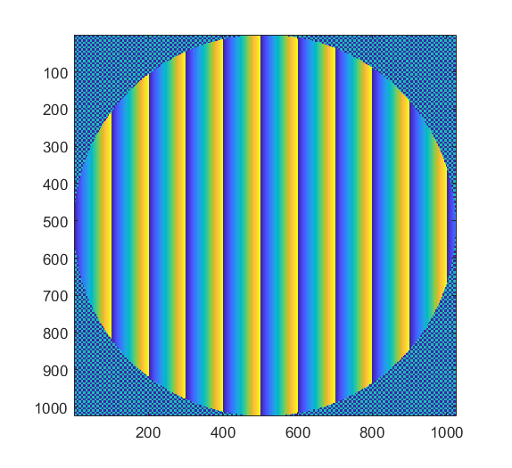
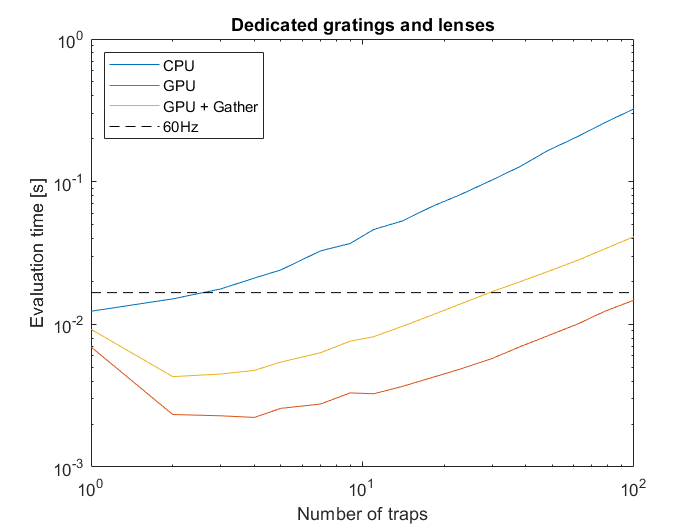
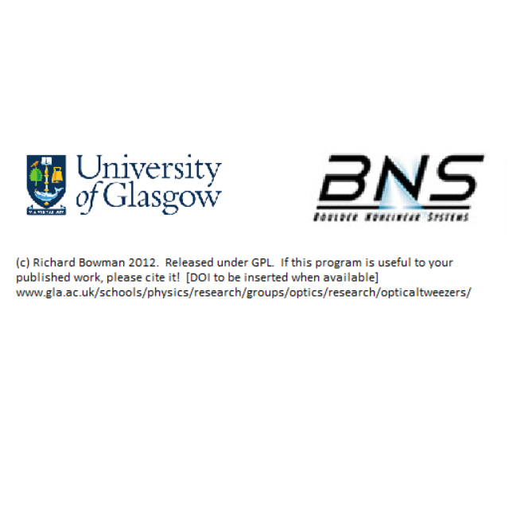

.. _example-using-the-gpu:

#############
Using the GPU
#############

The toolbox provides methods for accelerating the computation of
holograms by taking advantage of the computer graphics hardware. There
are two approaches for using the graphics hardware: (1) use the GPU as a
co-processor, sending instructions to be evaluated on the device as is
done in `HOTlab <https://github.com/MartinPersson/HOTlab>`__; and (2)
load a custom shader into the screen render pipeline as is done in
`RedTweezers <https://doi.org/10.1016/j.cpc.2013.08.008>`__.

Both these approaches have advantages and disadvantages. Communication
with the graphics hardware for co-processing is typically done using
very general languages such as
`CUDA <https://developer.nvidia.com/cuda-zone>`__ or
`OpenCL <https://www.khronos.org/opencl/>`__ which do not have direct
access to the render pipeline. Instructions and data is sent to the
device and the completed image is downloaded from the device once the
calculation is complete. In order to display a pattern on the screen,
the image must be copied back to the graphics hardware, introducing an
additional delay/overhead. The copy requirement is not a problem when
the intended target for the pattern is not the screen, for instance, if
the pattern is being saved to a file or sent over another connection
such as via USB, both these operations would require the pattern to be
copied regardless.

Instead, the pattern can be calculated as part of the graphics render
pipeline. This can be achieved by loading a custom
`OpenGL <https://www.khronos.org/opengl/>`__ shader program into the
graphics pipeline. Unlike CUDA or OpenCL, the OpenGL shader language
(GLSL) is optimized for drawing to the screen: GLSL programs are
compiled and loaded into the render pipeline. In contrast to
CUDA/OpenCL, which allow commands and data to be sent to the hardware, a
GLSL shader only allows data to be sent to the pre-compiled shader. The
shader must be recompiled every time the render pipeline changes, for
instance if we were to change from displaying linear gratings to sinc
patterns.

Both co-processing (via Matlab ``gpuArray``\ s) and GLSL shaders (via
RedTweezers) are implemented in OTSLM, they are described in the
following sections. Although it may be possible to achieve
interoperability between CUDA/OpenCL and OpenGL, these features are not
currently implemented.

.. contents:: Contents
   :depth: 3
   :local:
..

Using the GPU as a co-processor
===============================

Matlab supports calculations on the GPU via ``gpuArray`` objects. This
requires the `Matlab Parallel Computing
Toolbox <mathworks.com/help/parallel-computing/index.html>`__ and a
`compatible CUDA enabled graphics
card <mathworks.com/help/parallel-computing/gpu-support-by-release.html>`__.
Functions which create textures can be passed a additional parameter
``'gpuArray', true`` to enable using ``gpuArray``\ s.

.. code:: matlab

    im = otslm.simple.checkerboard([1024, 1024], 'gpuArray', true);

This pattern remains on the GPU until copied back. It is better to keep
the pattern on the GPU until we are finished with it. We can perform
operations on this pattern in a similar way to normal Matlab matrices,
for instance

.. code:: matlab

    sz = [1024, 1024];
    pattern = otslm.simple.checkerboard(sz, 'gpuArray', true);
    lin = otslm.simple.linear(sz, 100, 'gpuArray', true);
    ap = otslm.simple.aperture(sz, 512, 'gpuArray', true);

    % Combine patterns and finalize
    pattern(ap) = lin(ap);
    pattern = otslm.tools.finalize(pattern);

To copy the final pattern back from the GPU we can use the ``gather``
function:

.. code:: matlab

    pattern = gather(pattern);
    imagesc(pattern);

   simple pattern

Creating complex textures
-------------------------

The GPU often has significantly less memory than the main computer. This
means that methods like ``otslm.tools.combine`` become memory limited
sooner. In order to work around this, it is sometimes possible to
implement a version which calculates each pattern, adds it to the total
array and re-uses the same memory to calculate the next pattern. The
``otslm.tools.lensesAndPrisms`` function implements the Prisms and
Lenses algorithm without needing to generate all the patterns before
combining.

.. code:: matlab

    xyz = randn(3, num_points);
    pattern = otslm.tools.lensesAndPrisms(sz, xyz, 'gpuArray', true);

Using a GeForce GTX 1060 GPU to run the Prisms and Lenses algorithm
produces a order of magnitude decrease in run-time for multiple traps
compared to a i7-8750H CPU.

   simple pattern

Using iterative algorithms
--------------------------

Iterative algorithms can use GPU arrays if either the target or guess
are gpuArrays or if the iterative method is constructed using the named
parameter ``'gpuArray', true``. Not all methods support using the GPU at
this stage, for instance, Bowman2017 has not been modified to support
the GPU. The iterative methods have not been optimised and they
currently involve a lot of copy/matrix resizing operations which will
probably slow down optimisation. We aim to address these limitations in
future versions.

.. code:: matlab

    sz = [512, 512];
    im = otslm.simple.aperture(sz, sz(1)/20, 'value', [0, 1], 'gpuArray', true);
    gs = otslm.iter.GerchbergSaxton(im, 'adaptive', 1.0, 'objective', []);
    pattern = gs.run(600, 'show_progress', false);

Uploading a shader to the GPU
=============================

For uploading OpenGL shaders to the GPU, we provide an interface to
`RedTweezers <https://doi.org/10.1016/j.cpc.2013.08.008>`__. RedTweezers
operates as a UDP server that runs independently from Matlab, this means
it can run on any computer with OpenGL capabilities connected to your
network (with appropriate firewall permission). Images, shaders and
other data can be sent to RedTweezers via UDP, the RedTweezers server
deals with uploading the shader and managing the shaders memory.

Installing RedTweezers
----------------------

To use RedTweezers, you will need to download the executable and have it
running on a computer that is accessible on your network. RedTweezers
can be downloaded from the `computer physics communications program
summaries page <http://cpc.cs.qub.ac.uk/summaries/AEQH_v1_0.html>`__.
Once downloaded, unzip the file (on windows you can use a such as
`7-zip <https://www.7-zip.org/>`__ to extract the files from the
``.tar.gz`` archive). Once unzipped, run either the
``hologram_engine_64.exe`` (or ``hologram_engine.exe`` for the 32-bit
version). On the first run you may need to allow access to your network.
If everything worked correctly, a new window with the RedTweezers splash
screen should be displayed:

   red tweezers splash

Displaying a image with RedTweezers
-----------------------------------

Displaying images isn't the intended purpose of RedTweezers, however by
loading a shader which simply draws a texture to the screen we can
implement a ``ScreenDevice``-like interface using RedTweezers. This is
implemented by ``otslm.utils.RedTweezers.Showable``. This class inherits
from ``otslm.utils.Showable`` (in addition to the ``RedTweezers`` base
class) and provides all the same functionality of a
``otslm.utils.ScreenDevice`` object. By default the object is configured
to connect to UDP port ``127.0.0.1:61557`` and display an amplitude
pattern. We can change the port and pattern type using the optional
arguments.

.. code:: matlab

    rt = otslm.utils.RedTweezers.Showable('pattern_type', 'phase');
    rt.window= [100, 200, 512, 512];   % Window size [x, y, width, height]
    rt.show(otslm.simple.linear([200, 200], 20));

The main difference between ``ScreenDevice`` and
``RedTweezers.Showable`` is the size of the pattern and the
size/position of the window. ``ScreenDevice`` requires the pattern size
to match the size of the window. For ``RedTweezers.Showable``, the
pattern is stretched to fill the window. A further limitation is the
maximum packet size RedTweezers supports only allows images of
approximatly 400x400 pixels (RedTweezers isn't intended for displaying
images).

Using the RedTweezers Prisms and Lenses
---------------------------------------

``otslm.utils.RedTweezers.PrismsAndLenses`` implements the Prisms and
Lenses algorithm described in the RedTweezers paper (and implemented in
the LabView code supplied with RedTweezers). To use the Prisms and
Lenses implementation, start by creating a new instance of the object
and configure the window and any other RedTweezers properties.

.. code:: matlab

    rt = otslm.utils.RedTweezers.PrismsAndLenses();
    rt.window= [100, 200, 512, 512];   % Window size [x, y, width, height]

Then we need to configure the shader properties. These are not set by
default since they may already be set by another program.

.. code:: matlab

    rt.focal_length = 4.5e6;       % Focal length [microns]
    rt.wavenumber = 2*pi/1.064;    % Wavenumber [1/microns]
    rt.size = [10.2e6, 10.2e6];    % SLM size [microns]
    rt.centre = [0.5, 0.5];
    rt.total_intensity = 0.0;   % 0.0 to disable
    rt.blazing = linspace(0.0, 1.0, 32);
    rt.zernike = zeros(1, 12);

This should create a blank hologram. To add spots to this hologram use
the ``addSpot`` method. For example, to add a spot to diffract light to
a particular coordinate in the focal plane, use:

.. code:: matlab

    rt.addSpot('position', [60, 54, 7])
    rt.addSpot('position', [-20, 10, -3])
    rt.addSpot('position', [40, -37, 0])

If we have more than 50 spots we need to send the spot data as a GLSL
texture. The class automatically handles this. If we want to always use
a texture, we can set

.. code:: matlab

    rt.use_texture = true;

Creating custom RedTweezers shaders
-----------------------------------

To create a custom GLSL shader and load it using RedTweezers simply
inherit from the ``otslm.utils.RedTweezers.RedTweezers`` class, load the
GLSL shader source using the ``sendShader`` commend, and use
``sendUniform`` and ``sendTexture`` to send data to the shader. For
inspiration, look at the ``Showable`` and ``PrismsAndLenses``
implementations.
