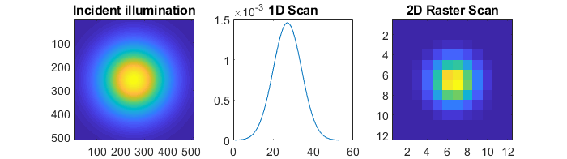
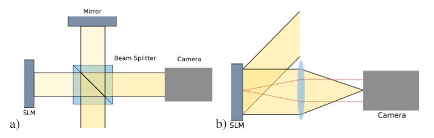

.. _utils-package:

###############
`utils` Package
###############

The ``otslm.utils`` package contains functions for controlling,
interacting with and simulating hardware.

Hardware (and simulated hardware) is represented by classes inheriting
from the ``Showable`` and ``Viewable`` base classes. ``Test*`` devices
are used for simulating non-physical devices, these are used mainly for
testing algorithms. For converting from a ``[0, 2*pi)`` phase range to a
device specific lookup table, the :class:`LookupTable`
class can be used. This package contains three sub-packages containing
`imaging algorithms <#imaging>`__, `calibration
methods <#calibration>`__ and an
`interface for RedTweezers <#redtweezers>`__.

.. contents::
   :depth: 1
   :local:
..

LookupTable
===========

.. automodule:: +otslm.+utils

.. autoclass:: LookupTable
   :members: LookupTable, load, save, sorted,
      resample, linearised, valueMinimised

.. _utils-imaging:

imaging
=======

.. automodule:: +otslm.+utils.+imaging

This sub-package contains functions for generating an image of the
intensity at the surface of a phase-only SLM in the far-field of the
SLM.

To demonstrate how these function work, we can use the
:class:`TestFarfield` and :class:`TestSlm` classes.
From ``examples/imaging.m``, the following code demonstrates how
we can image the incident illumination on the device.
:numref:`utils-imaging-example` shows the incident illumination
and output from the two imaging methods.

.. code:: matlab

   % Setup camera and slm objects
   slm = otslm.utils.TestSlm();
   slm.incident = otslm.simple.gaussian(slm.size, 100);
   cam = otslm.utils.TestFarfield(slm);

   % Generate 1-D profile
   im = otslm.utils.imaging.scan1d(slm, cam, 'stride', 10, 'width', 10);

   % Generate 2-D raster scan
   im = otslm.utils.imaging.scan2d(slm, cam, ...
       'stride', [50,50], 'width', [50,50]);

.. _utils-imaging-example:


   Example output from imaging functions.
   (left) incident illumination.  (middle) 1-D scan.  (right)
   2-D raster scan.

.. contents::
   :depth: 1
   :local:
..

scan1d
------

.. autofunction:: scan1d

scan2d
------

.. autofunction:: scan2d

calibration
===========

This sub-package contains functions for calibrating the device and
generating a lookup-table. Most of these methods assume the SLM and
camera are positioned in one of the configurations shown in
:numref:`utils-calibration-setup`.

.. _utils-calibration-setup:


   Two different SLM configurations.
   (a) shows a Michelson interferometer setup. The SLM and reference mirror
   will typically be tilted slightly relative to each other.
   (b) shows a camera imaging the far-field of the device.

The sub-package contains several methods using these configurations.
Some of the methods can be fairly unstable. The most robust methods,
from our experience, are ``smichelson`` and ``step``, both are described
bellow. For information on the other methods, see the file comments and
``examples/calibration.m``.

.. contents::
   :depth: 1
   :local:
..

.. automodule:: +otslm.+utils.+calibration

smichelson
----------

This setup requires the device to be imaged using a sloped Michelson
interferometer. The method applies a phase shift to half of the device
and measures the change in fringe position as a function of phase
change. The unchanged half of the device is used as a reference.

The easiest way to use this method is via the ``CalibrationSMichelson``
graphical user interface.

The method takes two slices through the output image of the Viewable
obejct. The slices should be perpendicular to the interference fringes
on the SLM. The step width determines how many pixels to average over.
One slice should be in the unshifted region of the SLM, and the other in
the shifted region of the SLM. The slice offset, angle and width
describe the location of the two slices. The ``step_angle`` parameter
sets the direction of the phase step.

In order to understand the function parameters, we recommend using the
``CalibrationSMichelson`` GUI with the ``TestMichelson`` GUI.

.. todo:: Screen-shot showing GUI configuration and output

.. autofunction:: smichelson

step
----

This function requires the camera to be in the far-field of the device.
The function applies a step function to the device, causing a
interference line to appear in the far-field. The position of the
interference line changes depending on the relative phase of the two
sides of the step function. An extension to this function is
:func:`pinholes` which uses two pinholes instead of a step
function, allowing for more precise calibration.

The easiest way to use this method is via the
``CalibrationStepFarfield`` graphical user interface.
In order to understand the function parameters, we recommend using the
``CalibrationStepFarfield`` GUI with the ``TestFarfield`` GUI.

.. todo:: Screen-shot showing GUI configuration and output

.. autofunction:: step

pinholes
--------

.. autofunction:: pinholes

checker
-------

.. autofunction:: checker

linear
------

.. autofunction:: linear

michelson
---------

.. autofunction:: michelson

RedTweezers
===========

.. automodule:: +otslm.+utils.+RedTweezers

The RedTweezers sub-package provides classes for displaying patterns
using OpenGL using the GPU or OpenGL enabled CPU.
The main class is :class:`RedTweezers` which provides methods for
setting up the connection to the RedTweezers UDP server and sending
OpenGL uniforms, textures and shaders programs to the UDP server.
For these classes to work, you must have a running RedTweezers
UDP server setup on your network.
For example usage, see the :ref:`example-using-the-gpu` example.

.. contents::
   :depth: 1
   :local:
..

RedTweezers base class
----------------------

.. autoclass:: RedTweezers
   :members:

Showable
--------

.. autoclass:: Showable
   :members:

PrismsAndLenses
---------------

.. autoclass:: PrismsAndLenses
   :members:

PrismsAndLensesSpot
~~~~~~~~~~~~~~~~~~~

.. autoclass:: PrismsAndLensesSpot
   :members:

Base classes of showable and viewable objects
=============================================

.. automodule:: +otslm.+utils

These abstract base classes define the interface expected by the
various imaging, calibration and GUI functions/classes in the toolbox.
You can not directly create instances of these classes, instead
you must implement your own subclass or
use one of the predefined subclasses, see :ref:`utils-physical-devices`
or :ref:`utils-non-physical-devices`.

.. contents::
   :depth: 1
   :local:
..

Showable
--------

.. autoclass:: Showable
   :members:

Viewable
--------

.. autoclass:: Viewable
   :members:


.. _utils-physical-devices:

Physical devices
================

These classes are used to interact with hardware, including cameras,
screens and photo-diodes.

.. contents::
   :depth: 1
   :local:
..

ScreenDevice
------------

Represents a device controlled by a window on the screen. Devices
including some digital micro-mirror devices and spatial light modulators
can be connected as additional monitors to the computer and can be
controlled by displaying an image on the screen. This class provides an
interface for controlling a Matlab figure, making sure the window has
the correct size, and ensures the window is positioned above other
windows on the screen.

To use the ``ScreenDevice`` class, you need to specify which screen to
place the window on and how large the screen should be. To create a
full-screen window on monitor 1 you might do

.. code:: matlab

    scid = 1;
    scsz = get(0,'ScreenSize');
    target_size = fliplr(scsz(scid, 3:4));

    slm = otslm.utils.ScreenDevice(scid , 'target_size', target_size, ...
      'target_offset', [0, 0], 'pattern_type', 'phase', 'fullscreen', true);

The ``pattern_type`` argument specifies if the input pattern to the
``show`` methods should be a phase, amplitude or complex amplitude
pattern. To create a window that is not full-screen, we can simply pass
``false`` as the full-screen argument and set the corresponding target
window size and position offset.

To display a pattern on the device for 10 seconds, we can use

.. code:: matlab

    pattern = otslm.simple.linear(slm.size, 50);
    slm.show(pattern);
    pause(10);
    slm.close();

This configuration assumes the pattern has not yet been passed to the
finalize function (i.e. for a linear grating with a spacing of 50
pixels, the pattern should be in the range 0 to 1 and not 0 to 2pi). If
you are using pre-scaled patterns (in the range 0 to 2pi), you can set
the ``prescaledPatterns`` optional parameter in the constructor for the
ScreenDevice to true:

.. code:: matlab

    slm = otslm.utils.ScreenDevice(scid , 'target_size', target_size, ...
      'target_offset', [0, 0], 'pattern_type', 'phase', 'fullscreen', true, ...
      'prescaledPatterns', true);

To display a sequence of frames on the device, you can use multiple
calls to the ``show`` function. This will apply the colour-map during
the animation, which can be time consuming and reduce the frame rate. An
alternative is to pre-calculate the animation frames. To do this, we
generate a struct which can be passed to the ``movie`` function:

.. code:: matlab

    % Generate images first
    patterns = struct('cdata', {}, 'colormap', {});
    for ii = 1:100
      patterns(ii) = im2frame(otslm.tools.finalize(otslm.simple.linear(slm.size, ii), ...
          'colormap', slm.lookupTable));
    end

    % Then display the animation
    slm.showRaw(patterns, 'framerate', 100);
    slm.close();

Showable classes have multiple methods for showing patterns on the
device. The ``showRaw`` method takes patterns that are already in the
range of values suitable for the device. The ``show`` function converts
the specified pattern into the device value range (by applying, for
example, a colour-map or modulo to the pattern). The type of input to
the show function should match the ``patternType`` property, for
``ScreenDevice`` objects, ``patternType`` is set from the
``pattern_type`` parameter in the constructor. If ``patternType`` is
amplitude, the input to show is assumed to be a real amplitude pattern,
if ``patternType`` is phase, the input is assumed to be a phase pattern.
The ``showComplex`` function uses ``otslm.tools.finalize`` to convert
the complex amplitude to a phase or amplitude pattern (depending on the
value for ``patternType``), before calling ``show`` to display the
pattern on the device. Further details can be found in the documentation
for the ```Showable`` <#showable>`__ base class.

To setup the lookup table which is applied by ``show``, we can load a
lookup table from a file and pass it in on construction. If you don't
yet have a lookup table, you can use one of the calibration functions,
see `calibration <#calibration>`__. As an example, to load a lookup
table specified by a filename ``fname`` we could use the following:

.. code:: matlab

    lookup_table = otslm.utils.LookupTable.load(fname, ...
      'channels', [2, 2, 0], 'phase', [], 'format', @uint16, ...
      'mask', [hex2dec('00ff'), hex2dec('ff00')], 'morder',  1:8);

This assumes the file has 2 columns, we ignore the first and split the
second into the lower 8 bits and upper 8 bits. The lookup table has 3
channels, the first two channels have values from the second column in
the file, the third channel is all zeros. The format for the input is
``uint16``, we apply a ``mask`` to this input for each column and we
specify the order of the bits from least significant to most significant
(``morder``). The phase isn't specified in this lookup table, so we
assume it is linear from 0 to 2pi. For further details, see
`LookupTable <#lookuptable>`__.

To use this lookup table for the ``ScreenDevice``, we simply pass it
into the constructor:

.. code:: matlab

    slm = otslm.utils.ScreenDevice(1, 'target_size', target_size, ...
        'target_offset', [0, 0], 'lookup_table', lookup_table, ...
        'pattern_type', 'phase', 'fullscreen', true);

.. autoclass:: ScreenDevicce
   :members:

GigeCamera
----------

``Showable`` wrapper for cameras using the ``gigecam`` interface. This
class uses the ``snapshot`` function to get an image from the device.
The ``gigecam`` device is stored in the ``device`` property of the
class.

.. autoclass:: GigeCamera
   :members:

WebcamCamera
------------

``Showable`` wrapper for windows web-cameras. Uses the
``videoinput('winvideo', ...)`` function to connect to the device. This
class uses the ``getsnapshot`` function to get an image from the device.
The ``videoinput`` device is stored in the ``device`` property of the
class.

This class currently doesn't inherit from ``ImaqCamera`` but is likely
to in a future release of OTSLM.

.. autoclass:: WebcamCamera
   :members:

ImaqCamera
----------

``Showable`` wrapper for image acquisition toolbox cameras. Uses the
``videoinput(...)`` function to connect to the device. This class uses
the ``getsnapshot`` function to get an image from the device. The
``videoinput`` device is stored in the ``device`` property of the class.

.. autoclass:: ImaqCamera
   :members:

.. _utils-non-physical-devices:

Non-physical devices
====================

The ``utils`` package defines several non-physical devices which can be
used to test calibration or imaging algorithms.
The :class:`TestDmd` and :class:`TestSlm` classes are
Showable devices which can be combined with the
:class:`TestFarfield` or
:class:`TestMichelson` Viewable devices. These Showable
devices implement the same functions as their physical counter-parts,
except they store their output to a ``pattern`` property. The Viewable
devices require a valid TestShowable instance and implement a view
function which retrieves the ``pattern`` property from the Showable and
simulates the expected output.

For example usage, see the examples in the :ref:`utils-imaging` section.

.. contents::
   :depth: 1
   :local:
..

TestDmd
-------

.. autoclass:: TestDmd
   :members: TestDmd

TestSlm
-------

.. autoclass:: TestSlm
   :members: TestSlm

TestFarfield
------------

.. autoclass:: TestFarfield
   :members: TestFarfield

TestMichelson
-------------

.. autoclass:: TestMichelson
   :members: TestMichelson

TestShowable
------------

.. autoclass:: TestShowable
   :no-members:

